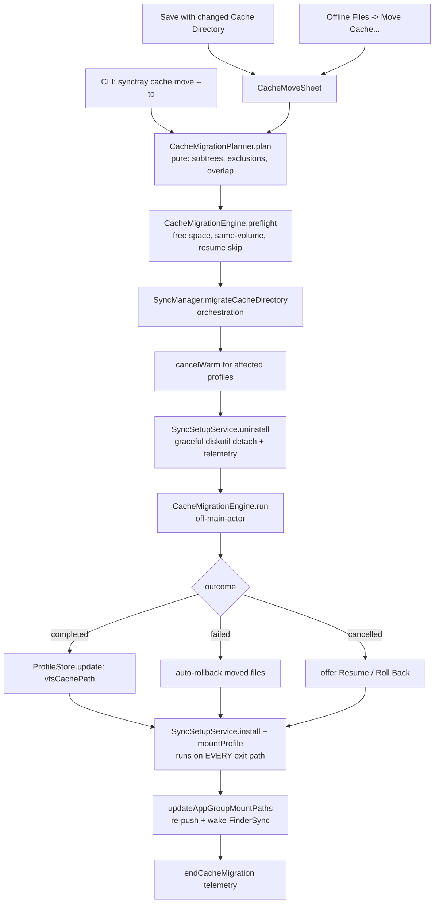

# Plan: Move the VFS cache directory when a Stream profile's Cache Directory changes

## TL;DR

**What.** Add a cache-relocation engine plus three entry points (Save-prompt sheet, an Offline Files "Move Cache…" action, and `synctray cache move <t> --to <p>`) that physically relocate a Stream profile's populated rclone VFS cache — **both** `{root}/vfs/<key>` and `{root}/vfsMeta/<key>` — from the old `vfsCachePath` to the new one.

**Why.** Today changing Cache Directory only re-points rclone (`vfsCachePath` is already in `reconcileAction`'s `needsReinstall` set, `SyncTray/Services/ConfigReconciler.swift:87`), so tens-to-hundreds of GB of already-downloaded bytes are abandoned and re-fetched over a slow link. The user's workflow is explicitly "warm onto the fast internal disk, then move the finished cache to the slow external drive".

**How.** A pure `CacheMigrationPlanner` resolves which subtrees move (handling profiles that share or *nest under* one cache root — they address the **same on-disk bytes**), and an impure-but-injected `CacheMigrationEngine` does per-file copy → byte-size verify → source delete, with a same-volume atomic-rename fast path, a free-space preflight, live progress, cancellation, resume, and auto-rollback on an integrity failure. Orchestration in `SyncManager` cancels any in-flight warm, uses the existing `SyncSetupService.uninstall` graceful detach, moves, persists `vfsCachePath` **only on success**, then re-installs and re-pushes the FinderSync App Group data.

**Done when.** All `checks.yaml` checks pass in this container, CI's `test` job (`xcodebuild … CODE_SIGNING_ALLOWED=NO build`) is green, and the branch `claude/cache-directory-migration-rsbsmr` is pushed with a walkthrough — **no PR is opened**.

## Background & Context

`rclone mount` / `rclone nfsmount` is started with `--cache-dir "$VFS_CACHE_PATH"` (`SyncTray/Services/SyncSetupService.swift:764`). Under that root rclone maintains **two fixed-name sibling trees**:

| Tree | Contents |
| --- | --- |
| `{root}/vfs/{remote}/{path}/…` | the cached file **data** |
| `{root}/vfsMeta/{remote}/{path}/…` | a mirror tree of per-file JSON sidecars: `ModTime`, `ATime`, `Size`, **and the list of downloaded byte ranges used by `--vfs-cache-mode full`** |

SyncTray's default `vfsCacheMode` is `full`. This makes `vfsMeta` load-bearing rather than incidental: relocate `vfs` without `vfsMeta` and rclone has no record of what is cached, so it re-downloads everything — defeating the entire purpose of the feature. `vfsMeta` appears **nowhere** in the repo today (`grep -rn vfsMeta --include=*.swift` → 0 hits), so `VFSCacheService.cacheDirectory(for:)` knowing only about `vfs` is a pre-existing latent gap that this change must close for the move path.

The second non-obvious property is **subtree sharing**. The cache key is `{remoteName-without-colon}/{remotePath}`. The user's two live profiles are `synology:Kaiju/KAIJU` and `synology:Kaiju/KAIJU/Reaper`; with a shared cache root they resolve to `…/vfs/synology/Kaiju/KAIJU` and `…/vfs/synology/Kaiju/KAIJU/Reaper` — the second is *inside* the first. Those are not merely adjacent trees: they are **the same bytes on disk**, serving both mounts. So a recursive move of the parent carries the child's data away, and a move of the child takes cached data the parent is also using.

## Requirements

Tags: `user-stated` means the dispatcher/user asked for it explicitly; `inferred` means planner-derived during Phase 1 research.

- R1 [user-stated] — Cross-volume correctness: a rename cannot cross volumes, so the engine must be copy → verify → delete per file, not a directory rename; detect the same-volume case and prefer an atomic rename there as a fast path.
- R2 [user-stated] — Free-space preflight on the destination volume before a single byte is copied; refuse with an actionable message if it will not fit.
- R3 [user-stated] — Progress (files done / total, bytes done / total) and cancellation; cancel must leave a consistent state with nothing half-copied that then gets deleted at the source.
- R4 [user-stated] — The mount must not be writing into the cache mid-move: unmount → move → remount, hooked into the existing reinstall path, reusing `SyncSetupService.uninstall`'s graceful volume detach and its `synctray.mount.reinstall_detach` telemetry rather than reinventing it.
- R5 [user-stated] — Cancel any in-flight warm first; `SyncManager.startWarm`/`cancelWarm` and `VFSCacheService.warmDirectory` actively read through the mount and a warm racing a move is a corruption path.
- R6 [user-stated] — Keep the three `vfsCachePath` consumers consistent: `SyncSetupService.generateProfileConfig` (`:957`), the script's `VFS_CACHE_PATH=$(parse_json "vfsCachePath" …)` read (`:558`), and `install`'s cache-dir pre-create (`:116`).
- R7 [user-stated] — Re-push the FinderSync App Group per-profile data after a move and re-wake the extension via the existing bidirectional `com.synctray.app.pinRequest` notification.
- R8 [user-stated] — Decide and document what an EXTERNAL `~/.config/synctray/profiles/*.profile.json` edit of `vfsCachePath` does, given it cannot show a modal; and do not break `ConfigSelfWriteRegistry` self-write suppression with the profile rewrites the move performs.
- R9 [user-stated] — Telemetry per `.claude/rules/telemetry.md`: a new counter, histograms and structured logs for the migration (outcome completed / cancelled / failed / preflight_rejected; bytes; files; duration; throughput; same-volume vs cross-volume), carrying no paths and no remote names.
- R10 [user-stated] — Threading per CLAUDE.md Critical Rule 1: `SyncManager` and `ProfileStore` are MainActor-isolated, so all file I/O runs off the main thread with values captured first and UI updates marshalled back; mark a genuinely pure static member `nonisolated` rather than assuming `static` escapes actor isolation.
- R11 [user-stated] — Docs: update CLAUDE.md (the mount/VFS/cache architecture section and the generated-files table) and add self-test coverage.
- R12 [user-stated] — Extend the DEBUG-only `ConfigSelfTest` suite with new AC-prefixed assertions, including CLI routing, following the existing pure-core / injected-spy style so the engine's decisions are testable with no real filesystem, process, or launchd touched. Do not add an XCTest target.
- R13 [user-stated] — Move only the edited profile's own subtree, content AND metadata.
- R14 [user-stated] — If other profiles still point at the old root, name them in the prompt and offer to migrate them in the same run, rewriting their `vfsCachePath`.
- R15 [user-stated] — Handle path-nested sibling profiles correctly: a naive recursive move of the parent must not swallow the child's subtree.
- R16 [user-stated] — Entry point A: changing Cache Directory and pressing Save opens a sheet offering Move existing cached files / Leave them behind / Start fresh (clear the old cache), then runs the move with progress and cancel BEFORE remounting.
- R17 [user-stated] — Entry point B: a standalone "Move Cache…" action in the Offline Files section next to Refresh / Clear Cache…, with a destination picker, so a move can be triggered without editing the profile form.
- R18 [user-stated] — Entry point C: `synctray cache move <name|shortId> --to <path>`, blocking until done, non-zero exit on failure, consistent with the existing mutating-command conventions in `SyncTray/CLI/SyncTrayCLI.swift`.
- R19 [user-stated] — Verify policy: per file, copy then confirm the destination file exists with an identical byte size, and only then delete the source file; then a final reconciliation of total file count and total bytes. No checksums.
- R20 [user-stated] — Any mismatch must abort, leave the source intact, and revert `vfsCachePath` so the profile is never left pointing at an incomplete cache.
- R21 [user-stated] — Every new `.swift` file must be registered in `SyncTray.xcodeproj/project.pbxproj` using the `xcodeproj` Ruby gem, never hand-edited, and validated afterwards by re-opening the project plus an append-only `git diff --stat` sanity check.
- R22 [user-stated] — Local compile and test are impossible on this host (no Swift toolchain), so `checks.yaml` must contain only checks that actually run in this container plus one explicitly CI-delegated compile check; no check may invoke `xcodebuild`.
- R23 [user-stated] — Work in place on the already-checked-out pinned branch `claude/cache-directory-migration-rsbsmr` with no second worktree, keeping artifacts under `.agent/claude-cache-directory-migration-rsbsmr/` with `.agent/` gitignored.
- R24 [user-stated] — Every commit ends with the trailer `Claude-Session: https://claude.ai/code/session_01FnCojx4XgeRpVPZayStGgZ`, the branch is pushed with `git push -u origin claude/cache-directory-migration-rsbsmr`, and no pull request is opened.
- R25 [inferred] — `vfsMeta` must move together with `vfs`, because under `--vfs-cache-mode full` it stores the downloaded byte-range list; relocating content alone makes rclone treat the cache as unpopulated and re-download it.
- R26 [inferred] — The cache-subtree key derivation must have exactly one home, shared by `VFSCacheService.cacheDirectory(for:)` and the migration planner, or the two drift and the engine relocates the wrong subtree.
- R27 [inferred] — Cache root paths must be tilde-expanded consistently, because `SyncSetupService.install` calls `expandingTildeInPath` while `VFSCacheService.cacheDirectory` does not.
- R28 [inferred] — Profiles whose cache keys overlap at a shared root address the same on-disk bytes, so declining co-migration costs the other profile real cached data; the non-interactive CLI must refuse by default rather than silently do that.
- R29 [inferred] — The move must be idempotent and resumable — a destination file whose byte size already matches is skipped — so a cancelled multi-hour transfer can be resumed instead of restarted.
- R30 [inferred] — Every new self-test assertion must ship with a pre-committed perturbation demonstrating that it fails on broken input.

### Out of Scope

- `VFSCacheService.clearCache` / `clearCacheSync` also leaving the `vfsMeta` tree behind. Same latent bug family, but changing clear semantics has its own risk profile (an orphaned meta tree can make rclone believe data is present after "Clear Everything") and is a separate behaviour change. Recorded as a follow-up.
- Adding a `SyncTray --self-test` step to `.github/workflows/ci.yml`. The CI `test` job runs only `scripts/check-schema-in-sync.sh` plus `xcodebuild build`, so the new self-test assertions do not gate CI. Adding that step cannot be validated from this Linux container and risks breaking a currently-green build.
- Any new persisted `SyncProfile` field. Avoided deliberately so `SyncTray/Resources/Schemas/profile.schema.json` needs no change and `scripts/check-schema-in-sync.sh` stays green by construction, with no migration to write.
- Migrating `WarmProgress` onto the shared byte/rate/elapsed formatting helper introduced for the new progress model. Touching `WarmProgress` widens blast radius on a host with no compiler; recorded as a follow-up.
- Opening a pull request.

## Decisions

| Decision | Alternatives Rejected | Rationale |
| --- | --- | --- |
| Move `vfs` **and** `vfsMeta` as a pair, modelled by one `CacheTreeKind` enum whose `rawValue` *is* the directory name | Move `vfs` only (today's implicit behaviour) | Verified against rclone: the two sibling names are fixed and `vfsMeta` holds the `--vfs-cache-mode full` byte-range list. Content-only relocation makes rclone re-download, i.e. the feature would silently not work. Enum-with-rawValue keeps the directory names in one place (adding a third tree kind is one edit). |
| Cache key derivation extracted to a single `VFSCacheService.cacheRelativePath(for:)`, called by both `cacheDirectory(for:)` and the planner | Re-derive "strip the colon, append `remotePath`" inside the planner | Two copies of a key derivation drift; if they disagree the engine relocates the wrong subtree and the mount finds an empty cache. Single home, mechanically asserted by AC-2. |
| Persist the new `vfsCachePath` **only** after the move reports `.completed` | Persist first and revert on failure | Strictly stronger than revert: there is no window in which the on-disk `.profile.json` points at an incomplete cache — which is exactly the invariant R20 asks for. Non-cache form fields still save on the abort path. |
| Integrity **failure** auto-rolls-back the files moved in this run; user **cancel** does not, and instead offers Resume or Roll Back | Auto-rollback on cancel too; never roll back | A split cache is not an acceptable resting state for an integrity event, so failure must self-heal. But auto-rolling-back a deliberate cancel could itself run for hours on the slow drive — worse than the state the user asked for. The engine is idempotent (AC-8), so Resume is cheap. |
| Overlapping same-root profiles are classified separately from merely-same-root ones; the CLI **refuses** on unresolved overlap unless `--include-overlapping` | Treat all same-root profiles as one "offer" set; always co-migrate; always refuse | Overlapping profiles share the same on-disk bytes, so declining co-migration costs the other profile real cached data. That is acceptable when a human is shown the names and confirms; it is not acceptable for a silent non-interactive command. |
| Planner takes only `coMigrate: Set<UUID>`; `--include-overlapping` resolves to that set before the call | An `includeOverlapping: Bool` parameter threaded into the planner | Removes a boolean parameter and makes "include overlapping when nothing overlaps" unrepresentable. `code-quality(plan)` finding. |
| Engine is a struct holding `fs` / `isCancelled` / `onProgress`, exposing `preflight(_:)` and `run(_:_:)` | Free functions taking 5 parameters | Parameter-cluster smell; the collaborators are per-run constants, not per-call arguments. `code-quality(plan)` finding. |
| Cross-volume copy tries `FileManager.copyItem`, then falls back to a data-only stream copy on failure | `copyItem` only; stream copy only; shell out to `rsync --remove-source-files` or `ditto` | The stated destination is a large external drive, potentially exFAT/HFS+, where `copyItem`'s xattr/ACL copying can fail and abort a multi-hour transfer. rclone's cache files carry no meaningful xattrs, so the fallback loses nothing. rsync was steelmanned and rejected: it adds a subprocess plus log-parsing fragility and no per-file verify control, and its main value is checksums, which D3 explicitly rules out. `optimize-approach(plan)` proposal P1. |
| Re-`install` runs on **every** orchestration exit path (success, failure, cancel, throw) | Re-install only after a successful move | Otherwise a failure between `uninstall` and `install` leaves the profile with no launchd agent. `optimize-approach(plan)` proposal P2. |
| External `.profile.json` edits of `vfsCachePath` keep today's behaviour — re-point via the existing `.reinstall` reconcile, no data move | Move data on an external edit; refuse an external edit | There is nobody to prompt, overlap resolution needs a human decision, and a multi-hour unattended relocation triggered by a file write is a hostile surprise. Data movement stays confined to the three explicit entry points. Documented in CLAUDE.md. |
| Profile rewrites go through `ProfileStore.update` / `ProfileStore.writeProfileFile` | Write the `.profile.json` directly | Those are the only writers that call `ConfigSelfWriteRegistry.shared.noteSelfWrite` (`ProfileStore.swift:174`), so the running `ConfigFileWatcher` suppresses the FSEvent our own write produces. Bypassing them would make the move re-trigger a reconcile. |
| The new decision function `cachePathChangeIntent` lives in `ConfigReconciler.swift` beside `reconcileAction`, marked `nonisolated static` | A new file; an instance method on `SyncManager` | Mirrors the established pure-decision-plus-injected-closure idiom in that file. `nonisolated` is required because the headless CLI calls it off the main actor — and `@MainActor` isolation is inherited by `static` members unless explicitly opted out. |
| New progress model `CacheMigrationProgress` mirrors `WarmProgress`'s shape, with shared byte/rate/elapsed formatting in a small `TransferFormat` helper in the same new file | Extend `WarmProgress` to serve both; duplicate its formatters verbatim | Conflating two unrelated operations in one published model is worse than a second model. Extracting the formatters gives the new code dedup at zero blast radius; retrofitting `WarmProgress` is a follow-up because there is no compiler on this host to catch a mistake. |
| Name everything `Cache…` (`CacheMigrationPlanner`, `CacheMigrationEngine`, `CacheMigrationProgress`) | `Migration…` | `SyncTray/Services/MigrationRunner.swift` already owns "migration" for the UserDefaults-blob-to-files sense; an unqualified name would read as that. |
| Fake FS in the self-test is a dumb `[String: Int64]` path→size map that records primitive calls | A fake that re-implements copy/verify/delete semantics | Structural lesson `mock-that-reimplements-the-thing-under-test` (seen 7×): a fake that re-encodes the logic under test can only confirm itself. The fake must be inert; the engine must be the only thing deciding. |
| Do not add a `SyncTray --self-test` CI step | Add one so the new assertions gate CI | Untestable from this container and a real risk to a green build; recorded as an explicit Out of Scope item and a `Degraded:` note rather than silently omitted. |

## Technical Approach

### Architecture Diagram



### Layering

1. **`CacheMigrationPlanner` — pure, no FS, no clock.** Given the moving profile, all profiles, the destination and the co-migrate set, it returns the subtree list (content + meta per migrating profile), the descendant relative paths to *exclude*, the profile ids to rewrite, the overlapping set, and the merely-same-root set — or a typed rejection.
2. **`CacheMigrationEngine` — impure, over an injected `CacheMigrationFileSystem` struct of closures.** `preflight` computes totals, the same-volume verdict, and the resume-skip set, and rejects on insufficient space. `run` executes the fast path or the per-file loop, reconciles, prunes empty source directories, and rolls back on failure.
3. **`SyncManager` orchestration — MainActor, dispatching the engine off-actor.** Owns `@Published cacheMigrationProgress`, the cancellable task, the warm cancellation, the uninstall/install bracket, the persist-on-success, the App Group re-push, and the telemetry span.
4. **Entry points** — `CacheMoveSheet` (two states: pick-a-destination, or confirm-a-pending-save), the Offline Files action, and the CLI subcommand over one new `CLIEnvironment.migrateCache` closure.

### Patterns to Follow

| New thing | Mimic | Why |
| --- | --- | --- |
| `CacheMigrationProgress` | `SyncTray/Models/WarmProgress.swift` | Same published-per-profile progress shape, phases, and formatted accessors. |
| `startCacheMigration` / `cancelCacheMigration` | `SyncManager.startWarm` (`:2301`) / `cancelWarm` (`:2318`) | Same supersede-previous-task-then-await-wind-down idiom, including the `await previous?.value` comment's reasoning. |
| `beginCacheMigration` / `endCacheMigration` | `TelemetryService.beginWarm` (`:1988`) / `endWarm` (`:2025`) | Same opaque-token span pattern, bounded metric labels, and log bodies. |
| `cachePathChangeIntent` | `SyncManager.reconcileAction` (`ConfigReconciler.swift:67`) | Pure decision beside its sibling, `nonisolated static`. |
| `CacheMigrationFileSystem` | `CLIEnvironment` (`SyncTrayCLI.swift:46`) | Struct-of-closures dependency injection is this repo's established testability idiom. |
| `cache move` subcommand | the `profile` group in `SyncTrayCLI.parse` / `parseProfile` (`:214`, `:226`) | Same two-token group parse, usage-error text, and bounded `telemetryVerb` mapping. |
| New self-test cases | `testCLIWriteCommands` (`ConfigSelfTest.swift:897`) and `fakeCLIEnvironment` (`:826`) | Same spy-closure style, `report(id, slug, passed, detail)` output, and default-overridable fake builder. |
| Destination picker | `ProfileDetailView.browseForFolder` (`:3089`) | Existing `NSOpenPanel` helper and copy conventions. |

### API / Interfaces

```swift
// SyncTray/Services/CacheMigrationPlanner.swift  — pure

/// The two fixed-name sibling trees rclone maintains under `--cache-dir`.
/// The rawValue IS the on-disk directory name, so the names live in one place.
enum CacheTreeKind: String, CaseIterable, Equatable {
    case content = "vfs"
    case meta    = "vfsMeta"
}

struct CacheSubtree: Equatable, Hashable {
    let kind: CacheTreeKind
    let relativePath: String        // e.g. "synology/Kaiju/KAIJU"
}

struct CacheMigrationPlan: Equatable {
    let sourceRoot: String                  // normalized: tilde-expanded, standardized, no trailing "/"
    let destinationRoot: String
    let subtrees: [CacheSubtree]            // content + meta per migrating profile
    let excludedRelativePaths: [String]     // descendant keys left behind (non-co-migrating overlaps)
    let profileIdsToRewrite: [UUID]
    let unresolvedOverlaps: [UUID]          // always empty in a successful plan
    let sameRootProfiles: [UUID]            // non-overlapping profiles at sourceRoot — the offer set
    func reversed() -> CacheMigrationPlan   // for rollback
}

enum CacheMigrationRejection: Equatable {
    case notMountMode
    case emptyDestination
    case destinationEqualsSource
    case destinationNestedWithSource        // either direction
    case unresolvedOverlap([UUID])
}

enum CacheMigrationPlanner {
    static func normalizeRoot(_ path: String) -> String
    static func plan(
        moving: SyncProfile,
        allProfiles: [SyncProfile],
        to destination: String,
        coMigrate: Set<UUID>
    ) -> Result<CacheMigrationPlan, CacheMigrationRejection>
}

// SyncTray/Services/VFSCacheService.swift — extended

extension VFSCacheService {
    /// Single home for the cache key. `cacheDirectory(for:)` and
    /// CacheMigrationPlanner BOTH call this so they cannot disagree.
    nonisolated static func cacheRelativePath(for profile: SyncProfile) -> String
    /// `{root}/vfsMeta/<key>` — the sibling of `cacheDirectory(for:)`.
    func metaCacheDirectory(for profile: SyncProfile) -> String?
}

// SyncTray/Services/CacheMigrationService.swift  — impure, injected

struct CacheMigrationFileSystem {
    var directoryExists:        (String) -> Bool
    var fileExists:             (String) -> Bool
    var enumerateFiles:         (String) -> [(relativePath: String, size: Int64)]
    var fileSize:               (String) -> Int64?
    var createDirectory:        (String) throws -> Void
    var copyFile:               (_ from: String, _ to: String) throws -> Void
    var copyFileDataOnly:       (_ from: String, _ to: String) throws -> Void
    var moveItem:               (_ from: String, _ to: String) throws -> Void
    var removeItem:             (String) throws -> Void
    var removeEmptyDirectories: (String) -> Void
    var volumeIdentifier:       (String) -> String?
    var availableCapacity:      (String) -> Int64?
    static func production() -> CacheMigrationFileSystem
}

struct CacheMigrationPreflight: Equatable {
    let totalFiles: Int
    let totalBytes: Int64
    let bytesToCopy: Int64          // excludes destination files already present at a matching size
    let sameVolume: Bool
}

enum CacheMigrationPreflightRejection: Equatable {
    case nothingToMove
    case destinationUnwritable
    case insufficientSpace(requiredBytes: Int64, availableBytes: Int64)
    case plan(CacheMigrationRejection)
}

enum CacheMigrationFailure: String, Equatable {
    case verifyMismatch, countMismatch, ioError, destinationUnwritable
}

struct CacheMigrationOutcome: Equatable {
    enum Result: Equatable {
        case completed
        case cancelled
        case failed(CacheMigrationFailure, rolledBack: Bool)
        case preflightRejected(CacheMigrationPreflightRejection)
    }
    let result: Result
    let filesMoved: Int
    let bytesMoved: Int64
    let sameVolume: Bool
}

struct CacheMigrationEngine {
    /// Free space required beyond the payload before a cross-volume move is allowed.
    static let freeSpaceHeadroomBytes: Int64 = 512 * 1024 * 1024

    let fs: CacheMigrationFileSystem
    let isCancelled: () -> Bool
    let onProgress: (_ filesDone: Int, _ bytesDone: Int64, _ currentFile: String) -> Void

    func preflight(_ plan: CacheMigrationPlan) -> Result<CacheMigrationPreflight, CacheMigrationPreflightRejection>
    func run(_ plan: CacheMigrationPlan, _ preflight: CacheMigrationPreflight) -> CacheMigrationOutcome
}

// SyncTray/Services/ConfigReconciler.swift — extended

/// What a Save that changed `vfsCachePath` must ask the user. Pure.
enum CachePathChangeIntent: Equatable {
    case none
    case promptMove(CacheMovePrompt)
}

struct CacheMovePrompt: Equatable {
    let profileId: UUID
    let sourceRoot: String
    let destinationRoot: String
    let overlappingProfileIds: [UUID]
    let sameRootProfileIds: [UUID]
}

extension SyncManager {
    nonisolated static func cachePathChangeIntent(
        from current: SyncProfile,
        to updated: SyncProfile,
        allProfiles: [SyncProfile]
    ) -> CachePathChangeIntent
}

// SyncTray/CLI/SyncTrayCLI.swift — extended

// CLICommand gains:
case cacheMove(target: String, destination: String, includeOverlapping: Bool)

enum CacheMigrationCLIResult: Equatable {
    case completed(files: Int, bytes: Int64, sameVolume: Bool)
    case rejected(String)
    case failed(String)
}

// CLIEnvironment gains exactly one closure:
var migrateCache: (_ profile: SyncProfile, _ destination: String, _ includeOverlapping: Bool) -> CacheMigrationCLIResult
```

### Edge Cases

| Edge case | Handling |
| --- | --- |
| Destination equals source (after normalization / tilde expansion) | `plan` → `.destinationEqualsSource`; the Save sheet never opens. |
| Destination nested inside source, or source inside destination | `plan` → `.destinationNestedWithSource`; refuse. Prevents a self-consuming walk. |
| Profile is not mount mode | `plan` → `.notMountMode`. CLI exits non-zero with an actionable message, mirroring `runSync`'s mount-profile refusal. |
| Source subtree does not exist (nothing cached yet) | `preflight` → `.nothingToMove`; the UI persists the new path with no move (this is the "Leave them behind" outcome, reached automatically). |
| Path-nested sibling **not** co-migrating | Its relative key is added to `excludedRelativePaths` and skipped during the walk; the same-volume whole-directory fast path is disabled whenever exclusions exist. |
| Path-nested sibling **is** co-migrating | Its subtree is inside the parent's, so the walk moves those files exactly once; the child's `vfsCachePath` is rewritten too. No double-move, no double-count. |
| Destination file already present at a matching size (resume) | Copy skipped; source file deleted; counted toward `filesMoved`/`bytesMoved`. This is what makes a cancelled run resumable. |
| Destination file present at a *different* size (a stale partial) | Treated as absent: removed, then copied fresh and verified. |
| `copyItem` fails on a non-APFS destination (xattr/ACL) | Retried once with `copyFileDataOnly`; only then `.failed(.ioError)`. |
| Cancel mid-file | The in-flight destination partial is removed before returning, so no half-file exists and the source file is still intact; outcome `.cancelled`. |
| Verify mismatch | Destination partial removed, auto-rollback of this run's moved files, `.failed(.verifyMismatch, rolledBack:)`, `vfsCachePath` never persisted. |
| Rollback itself fails | Reported as `.failed(reason, rolledBack: false)` with an error-severity log; the user is told which root holds what. Not silently swallowed. |
| Mount was **not** running when the move started | `SyncSetupService.uninstall` already records `detachResult = "not_mounted"`; the profile is re-installed but not re-mounted, matching its pre-move state. |
| App quits mid-move | The task is cancelled; both trees are on disk and `vfsCachePath` is unchanged, so the mount comes back on the old root. Re-running the move resumes (R29). |
| Tilde in `vfsCachePath` | Normalized via `expandingTildeInPath` in `normalizeRoot`, matching `SyncSetupService.install:116`. |

## Acceptance Criteria

- [ ] AC-1 (covers: R13, R25) — Where the cache tree kinds are enumerated, `CacheTreeKind` shall declare exactly `content = "vfs"` and `meta = "vfsMeta"`, and the planner shall emit one `CacheSubtree` per kind per migrating profile by iterating `CacheTreeKind.allCases`.
- [ ] AC-2 (covers: R26, R27) — When the cache subtree key is needed, both `VFSCacheService.cacheDirectory(for:)` and `CacheMigrationPlanner` shall obtain it from the single `VFSCacheService.cacheRelativePath(for:)` function, and `CacheMigrationPlanner.normalizeRoot` shall apply `expandingTildeInPath`.
- [ ] AC-3 (covers: R15, R28) — When another profile's cache key overlaps the moving profile's at the same root and is not in `coMigrate`, the planner shall return that id in an `unresolvedOverlap` rejection; when it is in `coMigrate`, the planner shall include its subtrees and its id in `profileIdsToRewrite`; and a non-overlapping same-root profile shall appear only in `sameRootProfiles`.
- [ ] AC-4 (covers: R1) — When source and destination share a volume identifier and there are no excluded descendants, the engine shall relocate whole subtrees with `moveItem`; otherwise it shall relocate file-by-file and shall never call `moveItem` on a subtree root.
- [ ] AC-5 (covers: R2) — When the destination volume's available capacity is below `bytesToCopy + freeSpaceHeadroomBytes`, `preflight` shall return `.insufficientSpace(requiredBytes:availableBytes:)` and `run` shall not be reached, so no destination file is created.
- [ ] AC-6 (covers: R19, R20) — For each file the engine shall copy, then compare the destination byte size to the source size, and only then delete the source; when the sizes differ it shall remove the destination partial and return `.failed(.verifyMismatch, …)` with every source file still present; and after the loop it shall compare `filesMoved`/`bytesMoved` against the preflight totals, returning `.failed(.countMismatch, …)` on a mismatch.
- [ ] AC-7 (covers: R20) — When a migration outcome is anything other than `.completed`, the orchestration shall not write `vfsCachePath`, so the persisted `.profile.json` still names the source root.
- [ ] AC-8 (covers: R3, R29) — While a migration runs, `SyncManager.cacheMigrationProgress[id]` shall publish files done/total and bytes done/total; when `isCancelled` returns true the engine shall stop at a file boundary, remove any in-flight destination partial, and return `.cancelled`; and when re-run, a destination file whose size already matches shall be skipped rather than re-copied.
- [ ] AC-9 (covers: R4) — When a migration starts, the orchestration shall call `SyncSetupService.uninstall` for each affected installed profile before the move, and shall call `SyncSetupService.install` on every exit path including failure, cancellation and a thrown error.
- [ ] AC-10 (covers: R5) — When a migration starts, `SyncManager.cancelWarm` shall be called for every affected profile before any file is touched.
- [ ] AC-11 (covers: R6) — `SyncSetupService.generateProfileConfig` shall continue to emit the `vfsCachePath` key, the generated script shall continue to read it with the same default, and `install` shall continue to pre-create the expanded cache directory, so all three consumers agree.
- [ ] AC-12 (covers: R7) — When a migration completes, `SyncManager.updateAppGroupMountPaths()` shall be called so the FinderSync App Group profile data is re-pushed and the extension is re-woken through the existing `pinRequest` notification.
- [ ] AC-13 (covers: R8) — When `vfsCachePath` changes via an external `.profile.json` edit, `SyncManager.reconcileAction` shall still return `.reinstall` and no migration entry point shall be invoked; and all profile rewrites the migration performs shall go through `ProfileStore`, which records the write in `ConfigSelfWriteRegistry`.
- [ ] AC-14 (covers: R9) — `TelemetryService` shall register the cache-migration counter, duration histogram, throughput histogram, files counter and bytes counter, expose `beginCacheMigration`/`endCacheMigration`, and no new telemetry call shall pass a cache path, remote name, or any path-valued expression as an attribute.
- [ ] AC-15 (covers: R10) — All migration file I/O shall run off the main actor with values captured first, and `SyncManager.cachePathChangeIntent` shall be declared `nonisolated static` so the headless CLI can call it.
- [ ] AC-16 (covers: R16) — When Save is pressed on a Stream profile whose Cache Directory changed, `cachePathChangeIntent` shall return `.promptMove` and the sheet shall offer exactly the three actions "Move existing cached files", "Leave them behind", and "Start fresh", with the move running before the remount.
- [ ] AC-17 (covers: R17) — The Offline Files section shall present a "Move Cache…" action alongside Refresh and "Clear Cache…" that opens the destination picker without editing the profile form.
- [ ] AC-18 (covers: R18) — When invoked as `cache move <target> --to <path>`, the CLI shall parse `.cacheMove`, route to `CLIEnvironment.migrateCache`, return a non-zero exit on rejection or failure, refuse a non-mount profile and an unresolved target, fail with EX_USAGE when `--to` is absent, and map the invocation to the bounded telemetry verb `cache-move`.
- [ ] AC-19 (covers: R11) — `CLAUDE.md` shall document the cache-move behaviour in the mount/VFS section, list the new source files in its tables, name `vfsMeta` in the generated-files table, and `.claude/rules/telemetry.md` shall list the new metrics, span and log records.
- [ ] AC-20 (covers: R12, R30) — Every new `AC-CM*` self-test function shall be registered in `ConfigSelfTest.run()`'s `checks` array, shall drive the planner/engine/CLI through fakes with no real filesystem, process or launchd access, and each shall have a pre-committed perturbation recorded in the Guard-Bites table that is demonstrated to flip it to FAIL.
- [ ] AC-21 (covers: R21) — Every new `.swift` file shall appear in `SyncTray.xcodeproj/project.pbxproj`, the project shall re-open cleanly under `xcodeproj` with every source build-phase file reference resolving on disk, and the pbxproj diff shall add lines only.
- [ ] AC-22 (covers: R22) — No entry in `checks.yaml` shall invoke `xcodebuild`, and the compile gate shall be represented by exactly one explicitly CI-delegated check.
- [ ] AC-23 (covers: R23) — Work shall be committed on branch `claude/cache-directory-migration-rsbsmr` with exactly one worktree, and the plan artifacts shall live under `.agent/claude-cache-directory-migration-rsbsmr/` with `.agent/` gitignored.
- [ ] AC-24 (covers: R24) — Every commit added on this branch shall end with the `Claude-Session:` trailer, and no pull request shall reference this branch.
- [ ] AC-25 (covers: R14) — When other profiles still point at the old cache root, the move prompt shall name them and offer co-migration, and accepting shall rewrite each co-migrated profile's `vfsCachePath` to the destination root.

### Guard-Bites table (mandatory — one perturbation per new assertion)

Each row names the exact edit that must flip the assertion to FAIL. The executor demonstrates each, then reverts, and asserts `git status --porcelain` is clean before committing.

| Assertion | Perturbation that must make it FAIL |
| --- | --- |
| AC-CM1 tree-kind pair | Remove `case meta = "vfsMeta"` from `CacheTreeKind`. |
| AC-CM2 single key home | Inline a second "strip colon + append remotePath" derivation inside the planner instead of calling `cacheRelativePath`. |
| AC-CM3 overlap classification | Move a nested-sibling id from `unresolvedOverlaps` into `sameRootProfiles`. |
| AC-CM4 volume routing | Force `sameVolume = true` unconditionally in `preflight`. |
| AC-CM5 space preflight | Drop `freeSpaceHeadroomBytes` from the comparison **and**, separately, return `.success` on an availableCapacity of 0 — only the second half proves the check is not one-directional. |
| AC-CM6 verify-before-delete | Reorder `removeItem(source)` ahead of the size comparison. |
| AC-CM7 persist-on-success-only | Persist `vfsCachePath` before consulting the outcome. |
| AC-CM8 cancel + resume | Return `.completed` instead of `.cancelled` when `isCancelled()` is true; separately, make the matching-size skip re-copy the file. |
| AC-CM9 install-on-every-path | Move the `install` call inside the `.completed` branch only. |
| AC-CM10 warm cancelled first | Delete the `cancelWarm` call. |
| AC-CM-CLI routing | Rename the `--to` flag so `parse` no longer produces `.cacheMove`; separately, make `telemetryVerb` return the raw target instead of `cache-move`. |

## Implementation Order

1. `SyncTray/Services/VFSCacheService.swift` — add `nonisolated static func cacheRelativePath(for:)`, refactor `cacheDirectory(for:)` to call it and to `expandingTildeInPath` its root, and add `metaCacheDirectory(for:)`.
2. Create `SyncTray/Services/CacheMigrationPlanner.swift` (pure planner, `CacheTreeKind`, `CacheSubtree`, `CacheMigrationPlan`, `CacheMigrationRejection`, `normalizeRoot`, `plan`, `reversed`).
3. Create `SyncTray/Models/CacheMigrationProgress.swift` (progress model + `TransferFormat` helper).
4. Create `SyncTray/Services/CacheMigrationService.swift` (`CacheMigrationFileSystem` + `production()`, `CacheMigrationPreflight`, rejection/failure/outcome types, `CacheMigrationEngine` with `preflight`, `run`, and the extracted `fastPathMove`, `moveFiles`, `moveFile`, `reconcile`, `pruneEmptySourceDirectories`, `rollback`).
5. `SyncTray/Services/ConfigReconciler.swift` — add `CachePathChangeIntent`, `CacheMovePrompt`, and `nonisolated static func cachePathChangeIntent`.
6. `SyncTray/Services/TelemetryService.swift` — register the five instruments in `setupOTel()`, add `CacheMigrationSpanToken`, `beginCacheMigration`, `endCacheMigration`.
7. `SyncTray/Services/SyncManager.swift` — add `@Published cacheMigrationProgress`, `cacheMigrationTasks`, `startCacheMigration` / `cancelCacheMigration` / `rollbackCacheMigration`, and the `migrateCacheDirectory` orchestration (cancel warms → uninstall → off-actor engine run → persist on success only → install on every exit path → `updateAppGroupMountPaths` → telemetry).
8. Create `SyncTray/Views/Settings/CacheMoveSheet.swift` (destination picker state + pending-save confirm state + progress/cancel/resume/rollback UI, reusing the `warmProgressRow` presentation idiom).
9. `SyncTray/Views/Settings/ProfileDetailView.swift` — route `saveProfile` through `cachePathChangeIntent`, add the sheet presentation state, and implement the three prompt actions.
10. `SyncTray/Views/Settings/OfflineFilesSection.swift` — add the "Move Cache…" button beside Refresh / "Clear Cache…" presenting the same sheet in destination-picker mode.
11. `SyncTray/CLI/SyncTrayCLI.swift` — add `.cacheMove` to `CLICommand`, the `cache` group to `parse`, `runCacheMove`, the `migrateCache` member on `CLIEnvironment` plus its `production()` wiring, the usage text, and the `telemetryVerb` mapping.
12. `SyncTray/Services/ConfigSelfTest.swift` — add the `AC-CM*` cases plus `fakeCacheMigrationFileSystem` (inert `[String: Int64]` map) and extend `fakeCLIEnvironment` with the new closure; register every new case in `run()`.
13. Register the four new `.swift` files in `SyncTray.xcodeproj/project.pbxproj` with the `xcodeproj` gem under `LANG=C.UTF-8 LC_ALL=C.UTF-8`.
14. Update `CLAUDE.md` and `.claude/rules/telemetry.md`.
15. Run every `checks.yaml` check; demonstrate each Guard-Bites perturbation and revert it; confirm a clean tree.
16. Commit with the `Claude-Session:` trailer, push the branch, produce the walkthrough. Do not open a PR.

## File Changes

| Action | File | Change | Reason |
| --- | --- | --- | --- |
| create | SyncTray/Services/CacheMigrationPlanner.swift | `CacheTreeKind`, `CacheSubtree`, `CacheMigrationPlan`, `CacheMigrationRejection`, `normalizeRoot`, `plan`, `reversed` | Pure subtree/overlap/exclusion resolution, testable with zero FS |
| create | SyncTray/Services/CacheMigrationService.swift | `CacheMigrationFileSystem`, preflight/failure/outcome types, `CacheMigrationEngine` | The copy → verify → delete engine over injected FS primitives |
| create | SyncTray/Models/CacheMigrationProgress.swift | `CacheMigrationProgress`, `TransferFormat` | Published per-profile progress for the move UI |
| create | SyncTray/Views/Settings/CacheMoveSheet.swift | Destination picker, co-migration offer, progress/cancel/resume/rollback | One sheet serving both UI entry points |
| modify | SyncTray/Services/VFSCacheService.swift | Add `cacheRelativePath(for:)` + `metaCacheDirectory(for:)`; make `cacheDirectory(for:)` use both and expand `~` | Single home for the cache key; `vfsMeta` awareness; agree with `install`'s tilde expansion |
| modify | SyncTray/Services/ConfigReconciler.swift | Add `CachePathChangeIntent`, `CacheMovePrompt`, `nonisolated static cachePathChangeIntent` | The Save-time decision, beside `reconcileAction` |
| modify | SyncTray/Services/SyncManager.swift | `cacheMigrationProgress`, task map, start/cancel/rollback, `migrateCacheDirectory` orchestration | Lifecycle: warm cancel, detach, move, persist-on-success, remount, App Group re-push |
| modify | SyncTray/Services/TelemetryService.swift | Five instruments, `CacheMigrationSpanToken`, `beginCacheMigration`, `endCacheMigration` | Make the migration measurable without emitting paths |
| modify | SyncTray/Views/Settings/ProfileDetailView.swift | `saveProfile` routes via `cachePathChangeIntent`; sheet state; three prompt actions | Entry point A |
| modify | SyncTray/Views/Settings/OfflineFilesSection.swift | "Move Cache…" button beside Refresh / Clear Cache… | Entry point B |
| modify | SyncTray/CLI/SyncTrayCLI.swift | `.cacheMove` command, `cache` parse group, `runCacheMove`, `migrateCache` env member + production wiring, usage, telemetry verb | Entry point C |
| modify | SyncTray/Services/ConfigSelfTest.swift | New `AC-CM*` cases, inert fake FS, extended `fakeCLIEnvironment`, registrations in `run()` | R12 coverage in the repo's only test harness |
| modify | SyncTray.xcodeproj/project.pbxproj | Register the four new files in the `SyncTray` target | Classic groups: an unregistered file will not compile in CI |
| modify | CLAUDE.md | Cache-move subsection, service/model tables, CLI table, generated-files table (`vfsMeta`) | R11 |
| modify | .claude/rules/telemetry.md | New metrics, span and log records | R11 |

## Existing Code Survey

| Planned new unit | Searched for | Closest existing match | Verdict | Rationale |
| --- | --- | --- | --- | --- |
| `CacheMigrationPlanner` | `grep -rn "vfsMeta"` → 0 hits; `grep -rn "moveItem\|copyItem"` → 0 hits (only `removeItem`); `grep -rln "Migrat\|relocate"` → `MigrationRunner.swift` (UserDefaults-blob→files, unrelated domain) | `VFSCacheService.cacheDirectory(for:)` — resolves *one* content dir, no meta, no overlap logic, no planning | BUILD NEW | Nothing plans cache-tree relocation. The overlapping-derivation it *does* share is extracted to `cacheRelativePath(for:)` and reused rather than duplicated, so the only genuinely new code is the plan/exclusion/overlap algebra. |
| `CacheMigrationEngine` | `grep -rn "moveItem\|copyItem\|volumeIdentifier\|volumeAvailableCapacity"` → 0 hits; `grep -rn "availableCapacity\|freeSpace\|systemFreeSize"` → 0 hits | none | BUILD NEW | The repo has no file-move, no volume-identity, and no free-space primitive at all — every search returned empty. |
| `CacheMigrationProgress` | `grep -rln "struct .*Progress"` → `WarmProgress.swift`, `SyncState.swift` (`SyncProgress`), `SyncProgressDetailView.swift` | `WarmProgress` (`Models/WarmProgress.swift:9`) | BUILD NEW | `WarmProgress` tracks a different operation with a different phase set and its own `@Published` dictionary; extending it would conflate two operations in one published model. Its byte/rate/elapsed *formatting* is genuinely duplicated, so that part is extracted into `TransferFormat` in the new file and reused; retrofitting `WarmProgress` onto it is a recorded follow-up. |
| `CacheMoveSheet` | `grep -n "\.sheet(\|showClearConfirm\|browseForFolder" ProfileDetailView.swift OfflineFilesSection.swift` → `showingReconfigureWizard`, `addRemoteTarget`, `showingFallbackBrowser`, `browseForFolder:3089`, the `Clear cached files?` alert | `ProfileDetailView.browseForFolder` (`:3089`) — a folder picker only, no progress or confirm flow | WRAP | The new sheet delegates folder selection to the existing `browseForFolder` `NSOpenPanel` helper and mirrors `OfflineFilesSection.warmProgressRow`'s progress presentation; only the destination/co-migration/confirm composition is new. |

## Tests

All assertions live in `SyncTray/Services/ConfigSelfTest.swift` and run via `SyncTray --self-test` (there is no XCTest target — CLAUDE.md Option A).

| Type | Test Case | File | Validates |
| --- | --- | --- | --- |
| unit (pure) | `AC-CM1` tree kinds cover `vfs` + `vfsMeta` and the plan emits both per profile | ConfigSelfTest.swift | R13, R25 |
| unit (pure) | `AC-CM2` `cacheDirectory(for:)` and the planner agree on the key for a colon/no-colon remote and a tilde root | ConfigSelfTest.swift | R26, R27 |
| unit (pure) | `AC-CM3` nested sibling → `unresolvedOverlap` when excluded, subtrees + rewrite when co-migrated, `sameRootProfiles` when disjoint | ConfigSelfTest.swift | R15, R28 |
| unit (fake FS) | `AC-CM4` same-volume ids → whole-subtree `moveItem`; differing ids → per-file; exclusions disable the fast path | ConfigSelfTest.swift | R1 |
| unit (fake FS) | `AC-CM5` capacity below payload + headroom → `.insufficientSpace`, zero destination writes recorded | ConfigSelfTest.swift | R2 |
| unit (fake FS) | `AC-CM6` call order is copy → size read → source remove; size mismatch → dest removed, source intact, `.verifyMismatch`; total mismatch → `.countMismatch` | ConfigSelfTest.swift | R19, R20 |
| unit (spy) | `AC-CM7` non-`.completed` outcome → persist spy never fires | ConfigSelfTest.swift | R20 |
| unit (fake FS) | `AC-CM8` cancel at a file boundary → `.cancelled` + partial removed; re-run skips matching-size destinations | ConfigSelfTest.swift | R3, R29 |
| unit (spy) | `AC-CM9` uninstall fires before the move; install fires on completed, cancelled and failed | ConfigSelfTest.swift | R4 |
| unit (spy) | `AC-CM10` `cancelWarm` spy fires for every affected profile before any FS call | ConfigSelfTest.swift | R5 |
| unit (fake env) | `AC-CM-CLI` `cache move t --to /p` parses; missing `--to` → 64; non-mount → non-zero; `migrateCache` spy fires with the right destination; `telemetryVerb` → `cache-move` | ConfigSelfTest.swift | R18 |
| manual | On a signed macOS build: create two Stream profiles sharing a cache root with nested remote paths, warm one, change Cache Directory, Save, choose Move, confirm progress and cancel/resume, then verify both trees relocated and the mount serves files without re-downloading | — | R16, R17, end-to-end |

## Risks

| Risk | Likelihood | Impact | Mitigation |
| --- | --- | --- | --- |
| No local compiler on this host, so a typo, a signature mismatch or an actor-isolation error is only caught by CI | HIGH | MEDIUM | Keep the new code additive and pattern-mirrored (every new symbol has a named twin in Patterns to Follow); mark the CLI-callable static `nonisolated` explicitly; treat the CI `test` job as the compile gate (AC-22) and iterate on it rather than guessing locally. |
| New `AC-CM*` self-test assertions do not gate CI, because the CI `test` job never runs `SyncTray --self-test` | HIGH | MEDIUM | Named as an explicit Out of Scope item and a `Degraded:` note rather than implied to be covered; the Guard-Bites table still forces each assertion to be shown to bite, and `checks.yaml` verifies registration statically. |
| `vfsMeta` semantics wrong in some rclone version, so the moved cache is still re-downloaded | LOW | HIGH | Verified against rclone documentation and forum reports that `vfs`/`vfsMeta` are fixed sibling names under `--cache-dir` and that `vfsMeta` carries the `--vfs-cache-mode full` byte-range list. The move is a superset of today's behaviour, so worst case it is no worse than leaving bytes behind. |
| A multi-hour cross-volume move is interrupted (quit, power, drive eject), leaving a split cache | MEDIUM | MEDIUM | `vfsCachePath` is never persisted until `.completed`, so the mount returns to the source root; the engine is idempotent so re-running resumes; failure auto-rolls-back, and cancel offers explicit Resume / Roll Back. |
| Declining co-migration silently costs an overlapping profile its cached bytes | MEDIUM | MEDIUM | Overlap is a first-class planner output; the prompt names the affected profiles; the CLI refuses without `--include-overlapping`. |
| A path leaks into telemetry via a new attribute | LOW | HIGH | AC-14 plus a static check asserting no path-valued expression is passed to a telemetry call in the new code; bounded enum values only. |
| `xcodeproj` gem invoked without a UTF-8 locale fails, and a hand-edit corrupts the project | MEDIUM | HIGH | Every gem invocation is prefixed `LANG=C.UTF-8 LC_ALL=C.UTF-8`; AC-21 re-opens the project and asserts every source file reference resolves plus an append-only diff. |

## Verification

- **After editing**: `bash scripts/check-schema-in-sync.sh` must stay OK (no `SyncProfile` field is added), and the pbxproj validator below must print `pbxproj OK`.
- **Before PR**: run every check in `.agent/claude-cache-directory-migration-rsbsmr/checks.yaml`, then delegate the compile gate to the CI `test` job in `.github/workflows/ci.yml` and poll it with the `mcp__github__*` tools after pushing. There is no Swift toolchain on this host, so the compile step cannot be run locally.

The pbxproj validator referenced by the after-editing check (Ruby block braces keep it out of the bullet above):

```bash
LANG=C.UTF-8 LC_ALL=C.UTF-8 ruby -e 'require "xcodeproj"
p = Xcodeproj::Project.open("SyncTray.xcodeproj")
t = p.targets.find { |x| x.name == "SyncTray" }
abort("unresolved refs") unless t.source_build_phase.files.all? { |f| f.file_ref && File.exist?(f.file_ref.real_path) }
puts "pbxproj OK"'
```

The CI compile command that gate corresponds to (kept in a code block, not a bullet, so the plan's Verification bullets stay brace-free and mechanically checkable):

```bash
xcodebuild -project SyncTray.xcodeproj -scheme SyncTray \
  -destination 'platform=macOS' -configuration Debug \
  build ONLY_ACTIVE_ARCH=YES CODE_SIGNING_ALLOWED=NO
```

### Environment notes the executor must honour

- **No `xcodebuild`, no `swift`, no `swiftc`.** Do not attempt a local build; do not add a `checks.yaml` check that invokes one.
- **No `gh`.** GitHub access is via the `mcp__github__*` MCP tools. Do not gate on `which gh`.
- **No `gw`, and no second worktree.** The pinned branch is already the checkout at `/home/user/sync-tray`; `git worktree add` on it would fail.
- **`xcodeproj` gem needs a UTF-8 locale.** Without `LANG`/`LC_ALL` set, Ruby's `Encoding.default_external` is `US-ASCII` and `Xcodeproj::Project.open` dies with `invalid byte sequence in US-ASCII`. Always prefix `LANG=C.UTF-8 LC_ALL=C.UTF-8`.
- **`scripts/check-schema-in-sync.sh --self-verify-faildetect` fails on this host** (`mktemp: too few X's in template`, GNU vs BSD `mktemp`). Pre-existing and unrelated; the plain check passes and is the one to use.
- **No sub-agent dispatch tool and no `timeout`-dependent CI watch.** Do not plan a step that needs either; report a skipped review/CI-watch step upward instead.

## Lessons applied

| Lesson | How it shaped this plan |
| --- | --- |
| `repo::mthines/sync-tray::aw-lessons::xcodeproj-gem-and-mainactor-gotchas` | Step 13 uses the `xcodeproj` gem with the documented `new_reference` + `source_build_phase.add_file_reference` pattern and AC-21 re-validates every `real_path`; `cachePathChangeIntent` is `nonisolated static` because `@MainActor` isolation is inherited by static members; `checks.yaml` asserts concrete artifacts rather than banned words, and the executor must first rule out its own new code as the false-positive source before amending a check. |
| `repo::mthines/sync-tray::aw-lessons::local-build-signing-and-rebase-pr-head` | The CI-delegated compile check is worded around `CODE_SIGNING_ALLOWED=NO`, which is what makes the signal comparable to CI (FinderSync signing otherwise aborts before Swift compilation). |
| `repo::mthines/sync-tray::aw-lessons::config-create-via-file-and-cli-subcommand` | `cachePathChangeIntent` is a new pure decision function in `ConfigReconciler.swift` beside `reconcileAction`; the CLI subcommand goes through the pure `parse`/`execute` core over an injected `CLIEnvironment`; the partially-forgiving `SyncProfile` decoder is why no new persisted field is introduced. |
| `repo::mthines/sync-tray::aw-lessons::executor-no-task-tool-and-no-timeout-cmd` | No plan step depends on sub-agent dispatch or a `timeout` binary; a skipped review/CI-watch step is reported upward. |
| `global::aw-lessons::sequential-task-dispatch-loses-cwd-and-context` | Every path in this plan is absolute or repo-relative from `/home/user/sync-tray`, with `file:line` anchors and the branch name pinned. |
| `global::aw-lessons::a-negative-assertion-must-be-shown-to-fail` and `…::gates-that-fail-open-grep-e-has-no-negative-lookahead` | The Guard-Bites table pre-commits one perturbation per assertion, with two-directional perturbations where a one-directional check would pass vacuously (AC-CM5, AC-CM8, AC-CM-CLI); `checks.yaml` avoids bare `! grep` in favour of counted/positive comparisons. |
| `global::aw-lessons::mock-that-reimplements-the-thing-under-test` (seen 7×, structural) | The fake `CacheMigrationFileSystem` is an inert `[String: Int64]` path→size map that only records calls; it never re-implements copy/verify/delete ordering, which is the thing under test. |
| `global::aw-lessons::confidence-plan-rule9-and-rule10-awk-pass-vacuously` | Requirements carry explicit greppable `R{n}` IDs matching list position; the documented rule 9 / rule 10 awk is known to fail open / fail closed respectively, so both were re-derived by hand. |
| `global::aw-lessons::confidence-plan-rule5-only-accepts-user-stated-or-inferred` | Exactly two tag spellings are used, and the note above the Requirements list mentions them without brackets so the tag count is not inflated. |
| `global::aw-lessons::process-and-setup-requirements-need-covering-acs` | The process/setup/negative requirements R21–R24 each carry a concrete guard AC rather than being treated as meta. |

**Promotion due:** `global::aw-lessons::mock-that-reimplements-the-thing-under-test` is at `seen_count 7`, `status: structural`, and `global::aw-lessons::a-negative-assertion-must-be-shown-to-fail` is at `seen_count 2`, `status: structural`. Both are promotion-eligible — consider `/create-skill diagnose autonomous-workflow`.

## Progress Log

- [2026-09-08T09:07:34Z] Phase 0: MODE SELECTION emitted — Full tier, architectural, ~15 files. Prerequisites: `gw` absent (moot, branch already checked out), `gh` absent so `ACCESS_PATH = mcp`, no Swift toolchain, `ruby`+`xcodeproj` 1.28.1 present, `.agent/` gitignored at `.gitignore:40`.
- [2026-09-08T09:07:34Z] Phase 0: restate-and-diff complete; 6 deltas surfaced, all resolved without re-litigating D1–D3. Missing-Information Gate: 5 gaps, all `advisory`, zero `blocking`.
- [2026-09-08T09:07:34Z] Phase 0: `interview` companion not invoked — its two jobs (restate-and-diff, missing-information gate) were pre-resolved by the dispatcher's D1–D3 and the inline fallback was run instead, per the dispatcher's explicit instruction not to re-ask D1/D2/D3.
- [2026-09-08T09:07:34Z] Phase 1: lorekit(memory.list repo::mthines/sync-tray loop::aw-lessons) — 4 lessons, all 4 matched.
- [2026-09-08T09:07:34Z] Phase 1: lorekit(memory.list global loop::aw-lessons) — 37 lessons, 6 matched and applied as constraints; 2 promotion-eligible.
- [2026-09-08T09:07:34Z] Phase 1: research — verified rclone's `vfs`/`vfsMeta` layout against upstream docs; read `VFSCacheService`, `ConfigReconciler`, `SyncTrayCLI`, `OfflineFilesSection`, `SyncSetupService` install/uninstall/generateProfileConfig, `SyncManager` mount/warm/App-Group paths, `ConfigSelfTest` patterns, `TelemetryService` warm block, and the CI workflow.
- [2026-09-08T09:07:34Z] Phase 1: `holistic-analysis` not invoked — the execution path was traced directly during research (no failed fix attempt precedes this work, which is the companion's stated trigger).
- [2026-09-08T09:07:34Z] Phase 1: Existing Code Survey — 4 planned creates, 3 `BUILD NEW` with empty searches recorded, 1 `WRAP`.
- [2026-09-08T09:07:34Z] Phase 1: code-quality(plan) — applied (15 suggestions integrated; single-source cache key, boolean removal, engine-as-struct, union-metadata enum).
- [2026-09-08T09:07:34Z] Phase 1: critical(plan) — skipped (no --critical flag).
- [2026-09-08T09:07:34Z] Phase 1: optimize-approach(plan) — 2 proposals adopted (data-only copy fallback; install-on-every-exit-path), analysis_confidence 92%; rsync steelman recorded under Decisions.
- [2026-09-08T09:07:34Z] Phase 1: spec-emission — skipped (no UI files in plan match the web-surface heuristic; this is a macOS SwiftUI app and no aw-target exists).
- [2026-09-08T09:07:34Z] Phase 2: worktree step ADAPTED — the mandated branch `claude/cache-directory-migration-rsbsmr` is already the checkout at `/home/user/sync-tray` (clean tree, `e92c30e`, 0 ahead / 0 behind `origin/main`), so `git worktree add` would fail. Working in place; this ephemeral container clone is dedicated to this task, so Phase 2's isolation intent is already satisfied. Dependency install skipped — no Swift toolchain exists on this host.
- [2026-09-08T09:07:34Z] Phase 2: plan v1 created (initial plan) with checks.yaml.
- [2026-09-08T09:07:34Z] Phase 2: all 25 `checks.yaml` checks EXECUTED against the zero-implementation baseline. Result: 22 silent (correct — nothing is built yet), 3 green (AC-11, AC-22, AC-23 lock behaviour/constraints that already hold). Zero tooling errors, so every `run:` is valid in this container.
- [2026-09-08T09:07:34Z] Phase 2: one fail-open check FOUND AND FIXED before the gate — AC-22's `run:` counted the literal `CI-DELEGATED` inside its own `run:` line (2 instead of 1), the exact self-referential-fixture trap in `aw-lessons::xcodeproj-gem-and-mainactor-gotchas` §c. Pattern re-anchored to `^  setup: "CI-DELEGATED` so the `run:` line cannot self-match.
- [2026-09-08T09:07:34Z] Phase 2: ARTIFACT PATH defect found and fixed — the branch name contains a `/`, so `confidence` rule #1/#11 and `aw-create-plan`'s `DIR=".agent/${BRANCH}"` resolve to `.agent/claude/cache-directory-migration-rsbsmr/`, while the dispatcher mandated the flattened `.agent/claude-cache-directory-migration-rsbsmr/`. Resolved by making the dash directory canonical and adding `.agent/claude/cache-directory-migration-rsbsmr` as a relative SYMLINK to it, so both conventions resolve to one copy with no drift. `.agent/` is gitignored, so nothing is committed.
- [2026-09-08T09:07:34Z] Phase 2: rule #8 defect found and fixed — the "After editing" bullet embedded a Ruby one-liner whose `{ |x| … }` blocks tripped the mechanical no-placeholder-braces check. The commands moved into fenced code blocks below the bullets; the bullets are now brace-free.
- [2026-09-08T09:07:34Z] Phase 2: the 3 baseline-green checks were PERTURBED to prove they bite — AC-11 (drop the `vfsCachePath` key from `generateProfileConfig`), AC-22 in BOTH directions (add a compiler invocation; remove the CI-delegated marker), AC-23 (hide `plan.md`). All four perturbations flipped the check to silent; all were reverted and `git status --porcelain` is empty.
- [2026-09-08T09:07:34Z] Phase 1: confidence(plan) — 93% (passed gate). LLM 93.2% (Completeness 95 / Feasibility 92 / No-ambiguity 92); deterministic rules 11/11 pass so the cap stayed at 100%.
- [2026-09-08T09:07:34Z] Phase 1: confidence(plan) rule notes — rule #9 verbatim exits 0 unconditionally (fails OPEN: unset awk `plan` variable) and rule #10 verbatim exits 1 whenever any create row exists (fails CLOSED, same cause), both per `global::aw-lessons::confidence-plan-rule9-and-rule10-awk-pass-vacuously`. Re-derived by hand with `$0` substituted: rule #9 → 24 user-stated requirements, all covered, and zero ACs citing a non-existent requirement; rule #10 → 4 create rows, 4 verdict rows. Rule #4 additionally ran the lesson's free companion assertion (no `create` row already exists on disk): 11 modify targets all tracked, 4 create targets all absent.
