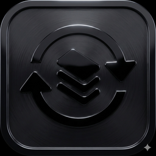

<p align="center">
  
</p>

<h1 align="center">SyncTray</h1>

<p align="center">
  <strong>Google Drive-style folder sync for any cloud</strong><br>
  A native macOS menu bar app that turns rclone into a seamless, automated sync experience.
</p>

<p align="center">
  
  
  
</p>

---

## What is SyncTray?

SyncTray brings the convenience of Google Drive or Dropbox sync to **any cloud storage** supported by [rclone](https://rclone.org/) - that's over 70 providers including:

- **Cloud Storage**: S3, Google Drive, OneDrive, Dropbox, iCloud Drive
- **Self-Hosted**: Synology NAS, NextCloud, WebDAV, SFTP servers
- **Object Storage**: Backblaze B2, Wasabi, MinIO

Instead of running complex terminal commands, SyncTray gives you:
- A **menu bar icon** showing sync status at a glance
- **Automatic scheduled syncing** that runs in the background
- **Real-time notifications** when files change
- **Multiple sync profiles** for different folders/remotes

Think of it as a lightweight sync client that works with any rclone remote you've already configured.

## Features

### Live Status Monitoring
- Menu bar icon shows current state (idle, syncing, error, drive not mounted)
- **Real-time progress** during sync: bytes transferred, percentage, ETA
- Animated sync icon while transfers are active (macOS 14+)

### Smart Notifications
- Batched file change notifications (lists 1-3 files, summarizes 4+)
- Click notifications to open the sync directory
- Error notifications with actionable details

### Multi-Profile Support
- Create unlimited sync profiles (Work, Personal, Archive, etc.)
- Each profile syncs on its own schedule
- Independent enable/disable per profile
- Per-profile status indicators in the menu

### Recent Changes
- View last 20 synced files in the menu dropdown
- See operation type: Copied, Updated, Deleted, Renamed
- Click any file to reveal it in Finder

### Automatic Background Sync
- Configurable sync interval (5-60 minutes per profile)
- Uses native macOS launchd - syncs even when app is closed
- Lock file prevents overlapping syncs
- Smart external drive detection - pauses when unmounted

### One-Click Actions
- **Sync Now**: Trigger immediate sync for all enabled profiles
- **Open Directory**: Jump to your local sync folder
- **View Log**: Open the sync log for troubleshooting

## Screenshots

*Coming soon*

## Requirements

- **macOS 13.0** or later
- **[rclone](https://rclone.org/)** installed and configured with at least one remote

### Installing rclone

```bash
# Using Homebrew (recommended)
brew install rclone

# Configure your first remote
rclone config
```

See [rclone's documentation](https://rclone.org/docs/) for detailed setup guides for each provider.

## Installation

### Option 1: Download Release
Download the latest `.app` from [Releases](../../releases) and drag to `/Applications`.

### Option 2: Build from Source
```bash
git clone https://github.com/mthines/sync-tray.git
cd sync-tray
xcodebuild -scheme SyncTray -configuration Release build
```

The built app will be in `~/Library/Developer/Xcode/DerivedData/SyncTray-*/Build/Products/Release/`.

## Getting Started

### 1. Launch SyncTray
The app icon appears in your menu bar. A yellow gear indicates setup is needed.

### 2. Create a Sync Profile
1. Click the menu bar icon → **Settings**
2. Click **+** to add a new profile
3. Configure:
   - **Name**: Give it a descriptive name (e.g., "Work Documents")
   - **Remote**: Select from your configured rclone remotes
   - **Remote Path**: Choose which folder on the remote to sync
   - **Local Path**: Pick the local folder to sync to
   - **Sync Interval**: How often to sync (default: 15 minutes)

### 3. Install the Profile
Click **Install** to activate the profile. SyncTray will:
- Create the local directory if needed
- Set up sync check files for safety
- Install a background scheduler (launchd agent)
- Start monitoring for changes

### 4. You're Done!
Your folder will now sync automatically on schedule. The menu bar shows sync status, and you'll get notifications when files change.

## Menu Bar States

| Icon | State | Meaning |
|------|-------|---------|
| Gray sync arrows | Idle | All syncs complete, system ready |
| Blue sync arrows (animated) | Syncing | Sync in progress |
| Red warning triangle | Error | Last sync failed - check logs |
| Orange drive with X | Drive Not Mounted | External drive disconnected |
| Yellow gear | Setup Required | No profiles configured |

## Advanced Configuration

### Additional rclone Flags
Each profile supports custom rclone flags. Common options:
- `--exclude "*.tmp"` - Exclude patterns
- `--bwlimit 1M` - Limit bandwidth
- `--dry-run` - Test without making changes

### External Drive Sync
When syncing to an external drive:
1. Enable "External Drive" toggle in profile settings
2. SyncTray auto-detects the mount point
3. Syncs pause when the drive is unmounted
4. Resume automatically when reconnected

### Resync (Reset Sync State)
If sync gets out of sync or shows persistent errors:
1. Open Settings → Select the profile
2. Click **Resync**
3. This resets rclone's bisync cache and performs a fresh comparison

### Conflict Resolution
SyncTray uses rclone bisync with smart conflict handling:
- Newer file wins by default
- Conflicts create backup copies with `-sync-conflict-` suffix
- Check the log file for conflict details

## File Locations

SyncTray creates these files (per profile):

| Location | Purpose |
|----------|---------|
| `~/.local/bin/synctray-sync.sh` | Shared sync script |
| `~/.config/synctray/profiles/{id}.json` | Profile configuration |
| `~/.local/log/synctray-sync-{id}.log` | Sync log output |
| `~/Library/LaunchAgents/com.synctray.sync.{id}.plist` | Background scheduler |

## Troubleshooting

### Sync shows error state
1. Click **View Log** in the menu to see detailed error messages
2. Common issues:
   - Remote not accessible (check network/credentials)
   - Check file missing (click Resync to recreate)
   - Conflicting changes detected (check log for details)

### Sync not running on schedule
1. Verify the profile is installed (green checkmark in Settings)
2. Check if launchd agent is loaded:
   ```bash
   launchctl list | grep synctray
   ```
3. Try uninstalling and reinstalling the profile

### Files not appearing in Recent Changes
- Only files actually transferred appear (unchanged files are skipped)
- Check that `--use-json-log` is being used (automatic with SyncTray)

## Development

### Building for Development

```bash
git clone https://github.com/mthines/sync-tray.git
cd sync-tray
xcodebuild -scheme SyncTray -configuration Debug build
```

### Architecture Overview

- **SyncManager**: Orchestrates all sync operations and state
- **ProfileStore**: Persists sync profiles to UserDefaults
- **LogWatcher**: Monitors log files in real-time via DispatchSource
- **LogParser**: Parses rclone JSON logs and plain text markers
- **SyncSetupService**: Generates scripts, configs, and launchd plists
- **NotificationService**: Handles smart batched notifications

### Commit Convention

This project uses [Conventional Commits](https://www.conventionalcommits.org/):

| Prefix | Version Bump | Example |
|--------|-------------|---------|
| `feat:` | Minor (0.X.0) | `feat: add dark mode support` |
| `fix:` | Patch (0.0.X) | `fix: resolve crash on launch` |
| `feat!:` | Major (X.0.0) | `feat!: redesign settings API` |

### Creating a Release

```bash
# Auto-detect version bump from commits
./scripts/release.sh

# Or specify: --major, --minor, --patch, or exact version
./scripts/release.sh --minor
./scripts/release.sh v1.2.3
```

## Contributing

Contributions are welcome! Please feel free to submit a Pull Request.

## License

MIT License - see [LICENSE](LICENSE) for details.

## Acknowledgments

- [rclone](https://rclone.org/) - The powerful sync engine that makes this possible
- Apple's SwiftUI and MenuBarExtra APIs
