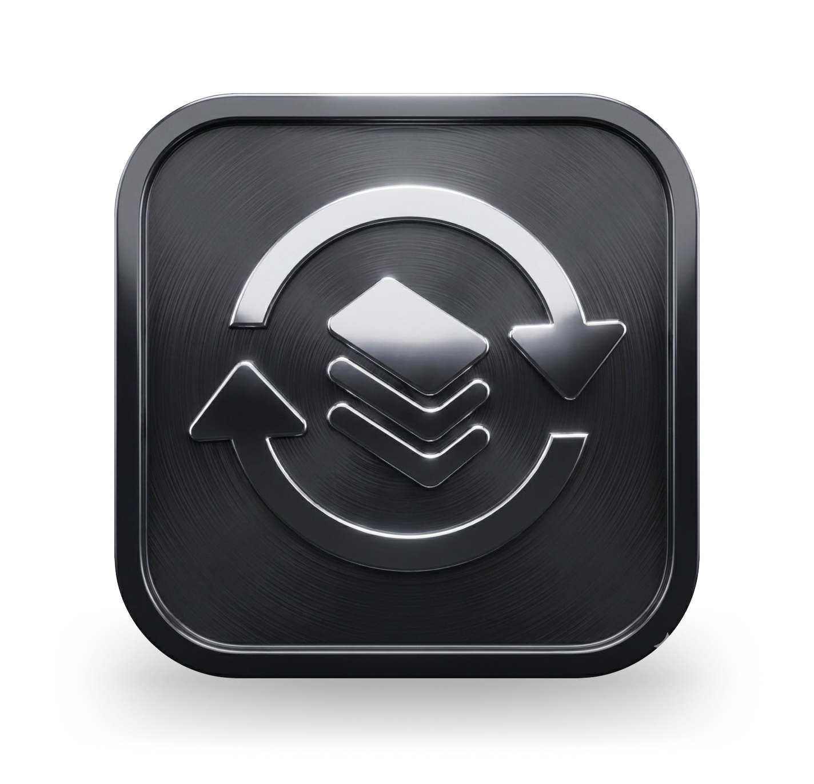
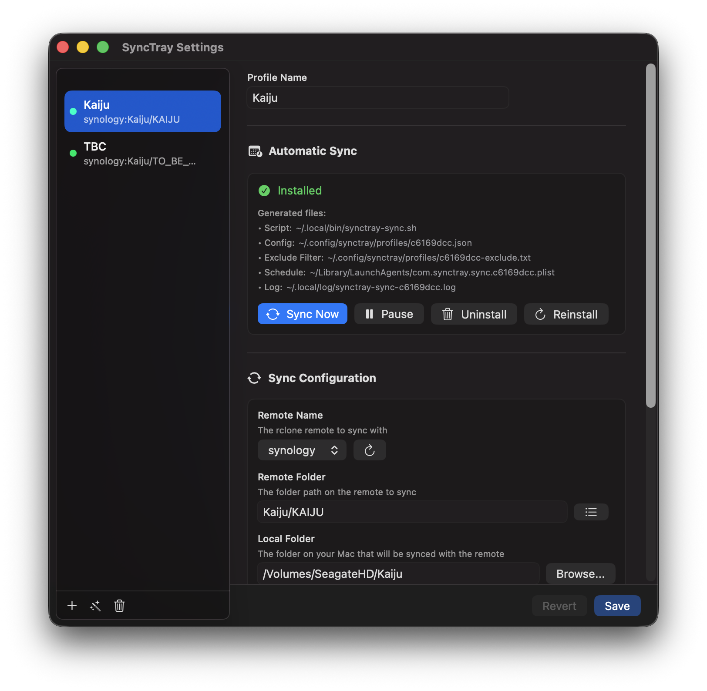
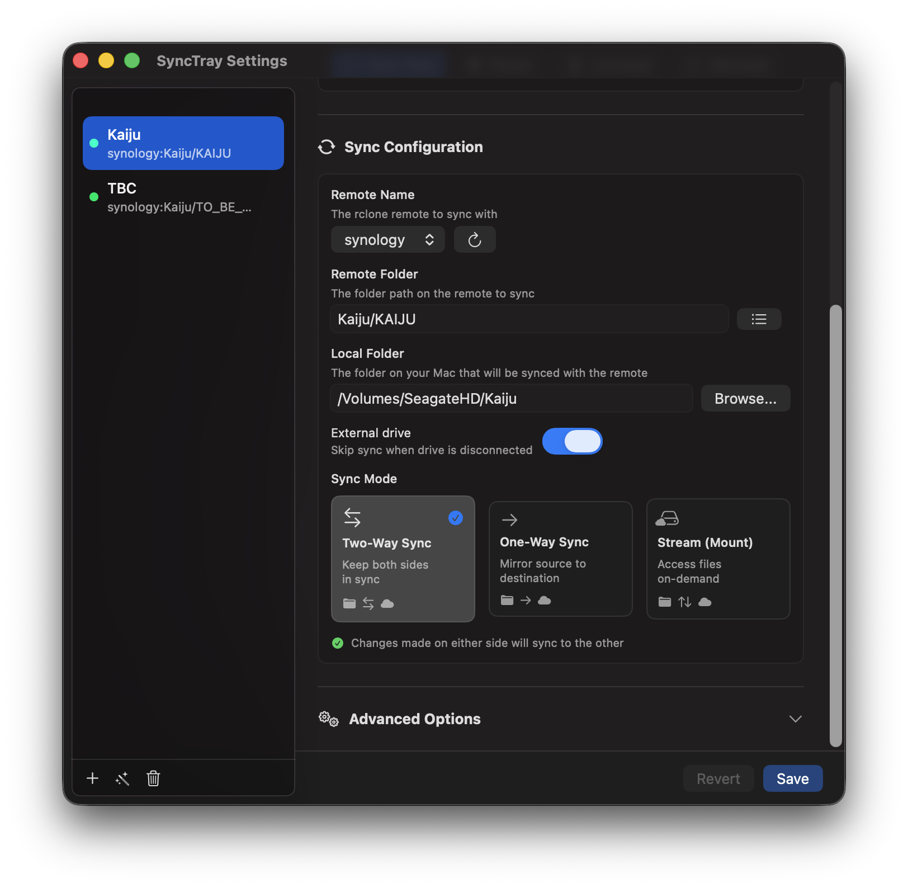
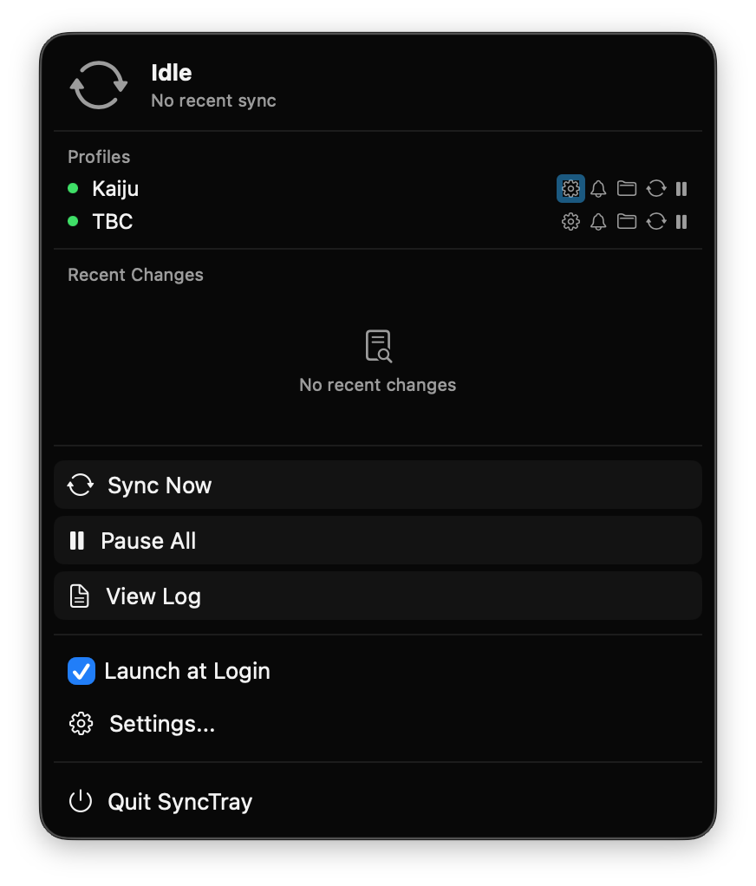
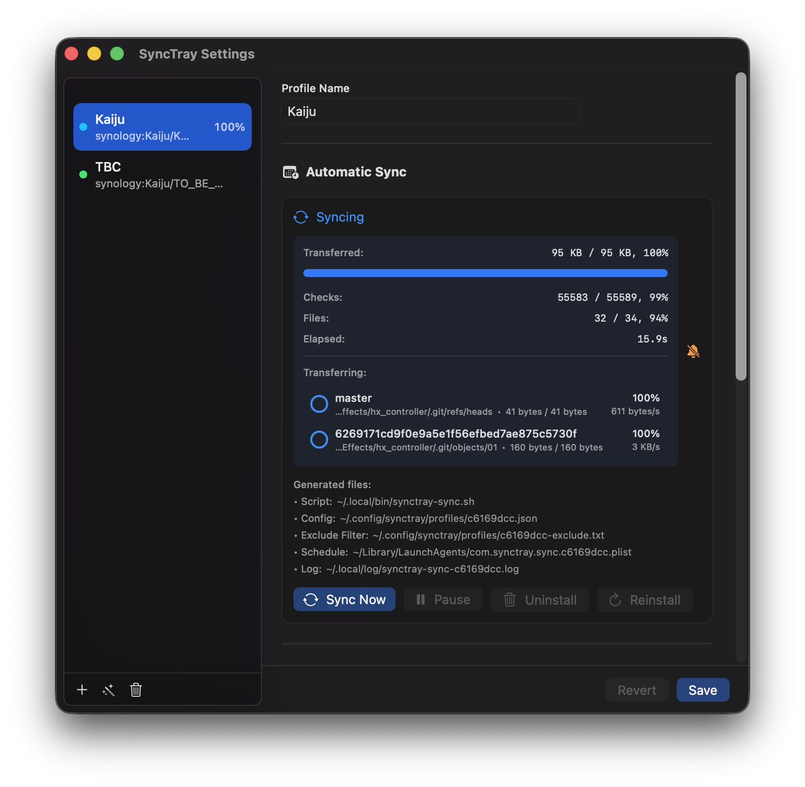
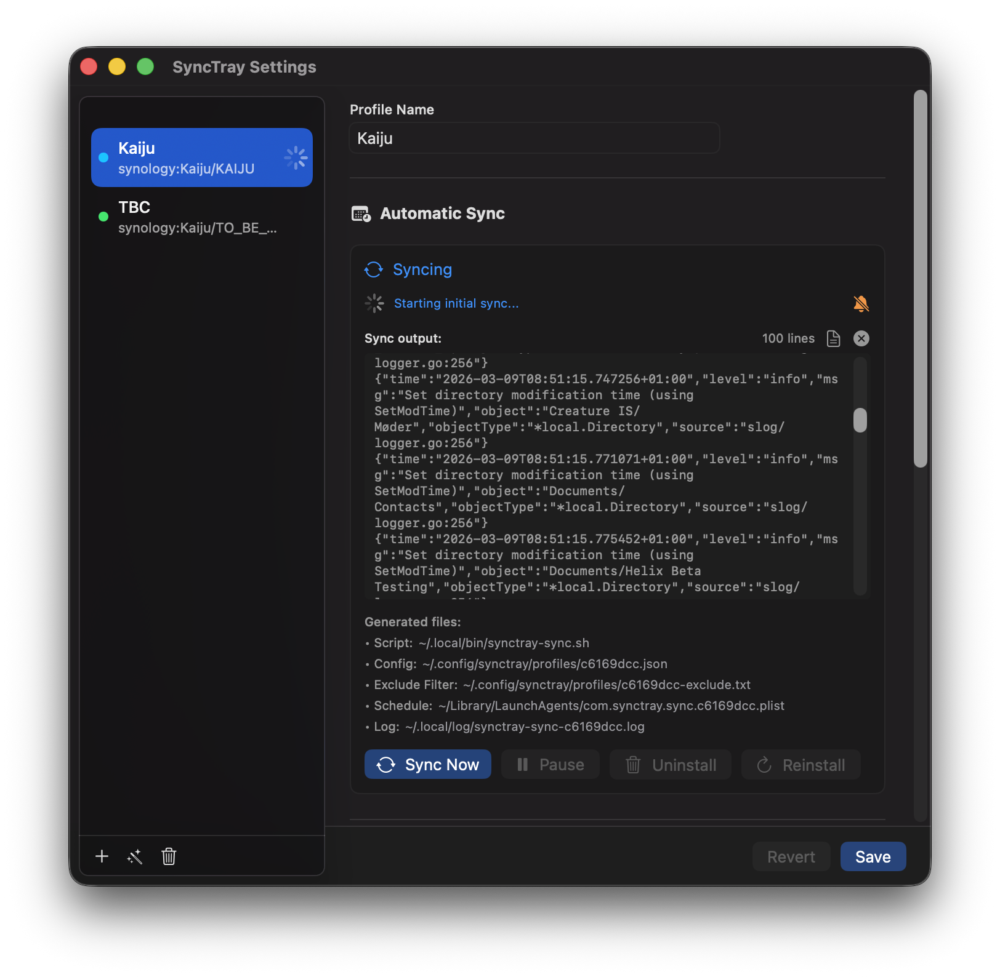
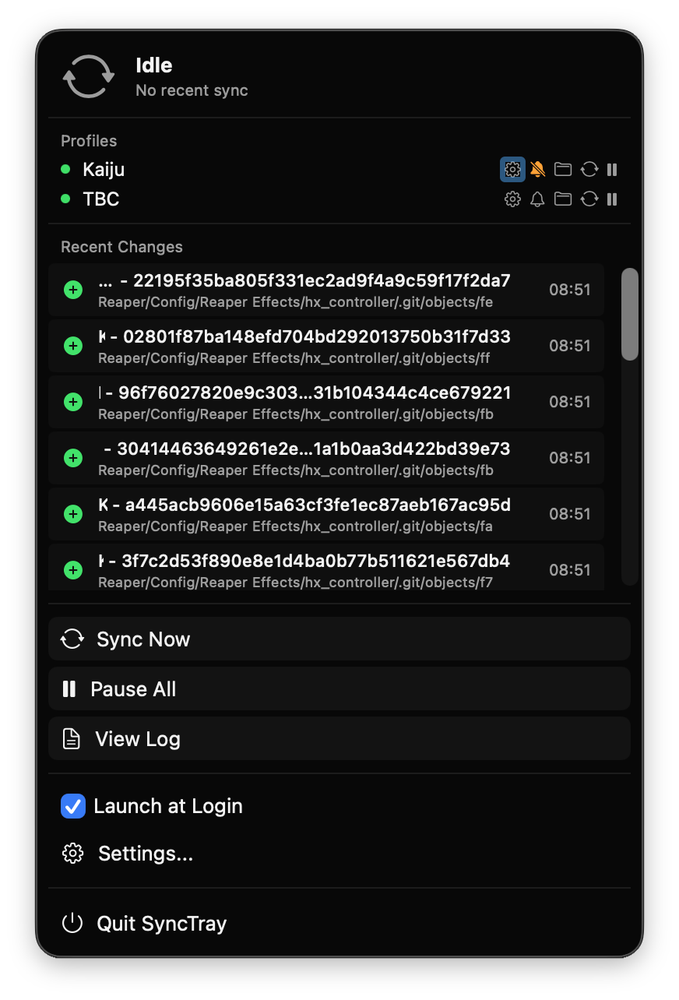
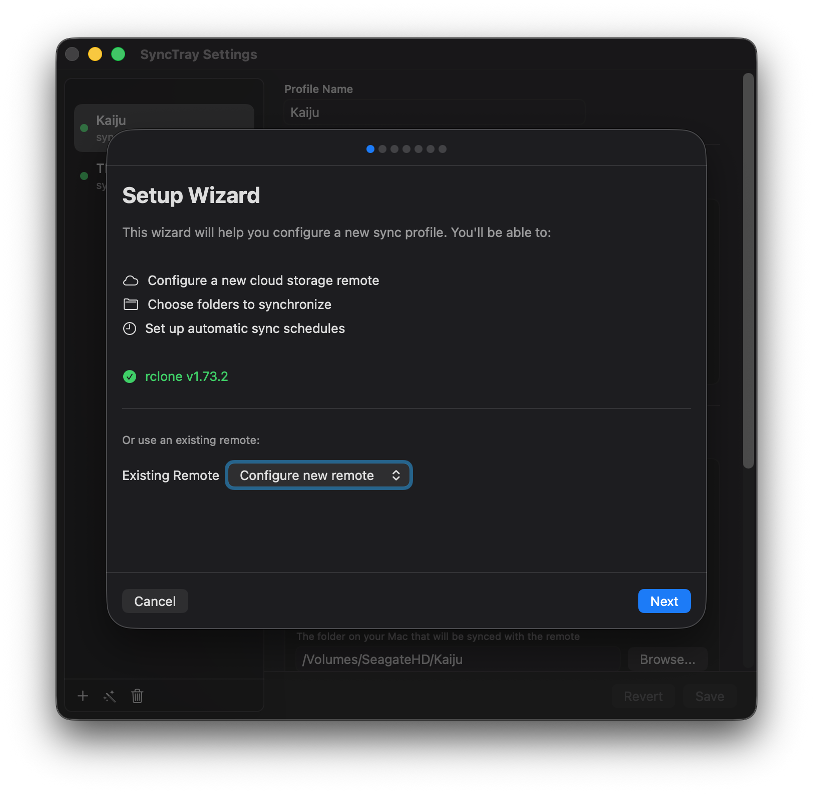
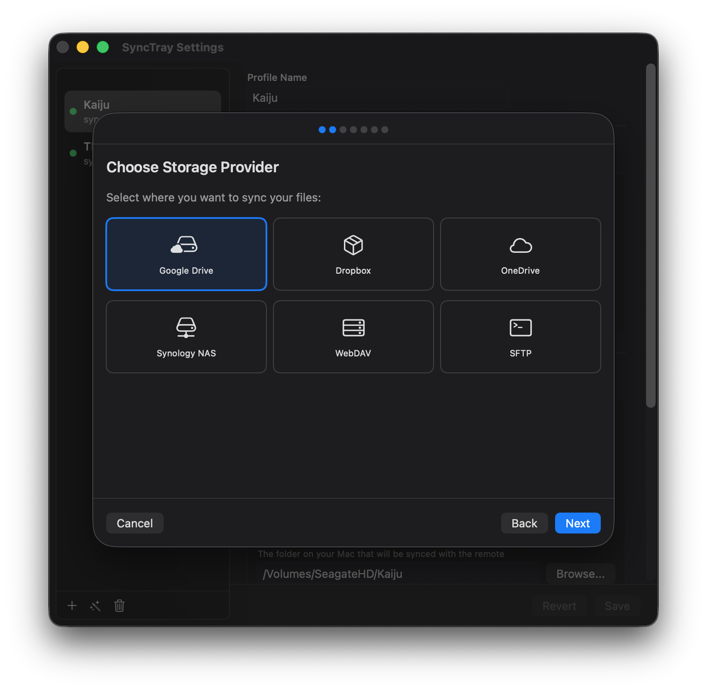
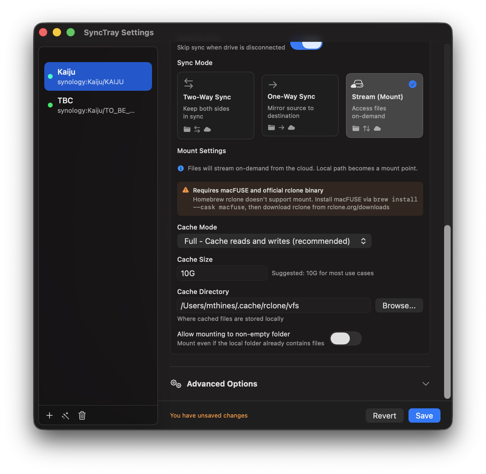

<p align="center">
  
</p>

<h1 align="center">SyncTray</h1>

<p align="center">
  <strong>Google Drive-style folder sync for any cloud</strong><br>
  A native macOS menu bar app with three sync modes: two-way sync, one-way backup, and on-demand streaming.
</p>

<p align="center">
  
  
  
</p>

<p align="center">
  
</p>

---

## What is SyncTray?

SyncTray brings the convenience of Google Drive or Dropbox sync to **any cloud storage** supported by [rclone](https://rclone.org/) - that's over 70 providers including:

- **Cloud Storage**: S3, Google Drive, OneDrive, Dropbox, iCloud Drive
- **Self-Hosted**: Synology NAS, NextCloud, WebDAV, SFTP servers
- **Object Storage**: Backblaze B2, Wasabi, MinIO

Instead of running complex terminal commands, SyncTray gives you:
- A **menu bar icon** showing sync status at a glance
- **Three sync modes** to match your workflow
- **Automatic scheduled syncing** that runs in the background
- **Real-time notifications** when files change
- **Multiple sync profiles** for different folders/remotes

---

## Sync Modes

SyncTray offers three ways to connect your files to the cloud:

| Mode | Best For | How It Works |
|------|----------|--------------|
| **Two-Way Sync** | Active working files | Changes on either side sync to the other |
| **One-Way Sync** | Backups & mirrors | Source overwrites destination |
| **Stream (Mount)** | Large media libraries | Files appear locally but stream on-demand |



### Two-Way Sync (Bisync)

Perfect for files you actively edit on multiple devices. Uses rclone's bisync to keep both sides synchronized.

- Edit a file locally → syncs to cloud
- Edit on another device → syncs back down
- Conflicts are resolved automatically (newer wins, old version backed up)

### One-Way Sync

Mirror files in one direction only. Choose your direction:

- **Local → Remote**: Backup your local files to the cloud
- **Remote → Local**: Mirror cloud files to your Mac

The destination always matches the source exactly.

### Stream (Mount)

Access cloud files without downloading them. Files appear in a folder on your Mac but are streamed on-demand when opened.

- No local storage used (beyond cache)
- Ideal for large media libraries or archives
- Configurable VFS cache for performance

> **Note**: Mount mode requires [macFUSE](#mount-mode-setup) and the official rclone binary.

---

## Features

### Live Status Monitoring



- Menu bar icon shows current state (idle, syncing, error, drive not mounted)
- **Real-time progress** during sync: bytes transferred, percentage, ETA
- Per-profile status indicators

During sync, see detailed transfer progress:



View sync output and logs directly in the app:



### Smart Error Recovery

When things go wrong, SyncTray detects the issue and offers one-click fixes:

| Error | Fix Button | What It Does |
|-------|------------|--------------|
| Sync out of sync | Smart Fix | Unlocks, recreates check files, resyncs |
| Lock file stuck | Remove Lock | Clears stale lock file |
| Check files missing | Create Check Files | Creates access check files on both sides |
| Mount folder not empty | Mount Anyway | Enables mounting to non-empty folders |

### Multi-Profile Support


- Create unlimited sync profiles (Work, Personal, Archive, etc.)
- Each profile syncs on its own schedule
- Independent enable/disable per profile
- Color-coded status indicators

### Recent Changes



- View last 20 synced files in the menu dropdown
- See operation type: Copied, Updated, Deleted, Renamed
- Click any file to reveal it in Finder

### Smart Notifications

- Batched file change notifications (lists 1-3 files, summarizes 4+)
- Click notifications to open the sync directory
- Error notifications with actionable details

### Automatic Background Sync

- Configurable sync interval (5-60 minutes per profile)
- Uses native macOS launchd - syncs even when app is closed
- Lock file prevents overlapping syncs
- Smart external drive detection - pauses when unmounted

---

## Requirements

- **macOS 13.0** or later
- **[rclone](https://rclone.org/)** installed and configured with at least one remote

### Installing rclone

```bash
# Using Homebrew
brew install rclone

# Configure your first remote
rclone config
```

See [rclone's documentation](https://rclone.org/docs/) for detailed setup guides for each provider.

### Mount Mode Setup

Stream (Mount) mode requires additional components:

#### 1. Install macFUSE

```bash
brew install --cask macfuse
```

After installation:
1. **Restart your Mac**
2. Go to **System Settings → Privacy & Security**
3. Approve the macFUSE kernel extension

#### 2. Install Official rclone Binary

> **Important**: Homebrew's rclone doesn't support mount mode. You need the official binary.

```bash
# Remove Homebrew version (if installed)
brew uninstall rclone

# Download and install official binary
curl -O https://downloads.rclone.org/rclone-current-osx-arm64.zip
unzip rclone-current-osx-arm64.zip
cd rclone-*-osx-arm64
sudo cp rclone /usr/local/bin/
sudo chmod +x /usr/local/bin/rclone

# Verify installation
rclone version
```

---

## Installation

### Option 1: Homebrew (Recommended)

```bash
brew tap mthines/synctray
brew install --cask synctray
```

### Option 2: Download Release

Download the latest `.zip` from [Releases](../../releases), extract, and drag `SyncTray.app` to `/Applications`.

**Note:** Since the app isn't notarized, you'll need to allow it once:

```bash
xattr -cr /Applications/SyncTray.app
```

### Option 3: Build from Source

```bash
git clone https://github.com/mthines/sync-tray.git
cd sync-tray
xcodebuild -scheme SyncTray -configuration Release build
```

---

## Getting Started

### 1. Launch SyncTray

The app icon appears in your menu bar. Click it to access settings.

### 2. Create a Profile

Click **Settings** → **+** to add a new profile. The wizard guides you through setup:



Select your cloud provider:



### 3. Configure Your Sync

#### For Two-Way Sync (Default)

1. Select your **rclone remote** and **folder**
2. Choose a **local folder** to sync
3. Set your **sync interval**
4. Click **Save** then **Install**


#### For One-Way Sync

1. Change **Sync Mode** to "One-Way Sync"
2. Choose **direction**: Local → Remote or Remote → Local
3. Configure remote and local paths
4. Click **Save** then **Install**

#### For Stream (Mount)

1. Change **Sync Mode** to "Stream (Mount)"
2. Configure your remote
3. Choose an **empty folder** as your mount point
4. Adjust **VFS cache settings** as needed
5. Click **Save** then **Install**



### 4. You're Done!

Your profile is now active. The menu bar shows sync status, and you'll get notifications when files change.

---

## Menu Bar Icons

| Icon | State | Meaning |
|------|-------|---------|
| ⟳ Gray | Idle | All syncs complete, system ready |
| ⟳ Blue (animated) | Syncing | Sync in progress |
| ⚠️ Red | Error | Last sync failed - check logs |
| 💾 Orange | Drive Not Mounted | External drive disconnected |
| ⚙️ Yellow | Setup Required | No profiles configured |

---

## Advanced Configuration

### Additional rclone Flags

Each profile supports custom rclone flags:

- `--exclude "*.tmp"` - Exclude patterns
- `--bwlimit 1M` - Limit bandwidth
- `--dry-run` - Test without making changes

### External Drive Sync

When syncing to an external drive:

1. Enable "External Drive" toggle in profile settings
2. SyncTray auto-detects the mount point
3. Syncs pause when the drive is unmounted
4. Resume automatically when reconnected

### VFS Cache Settings (Mount Mode)

| Cache Mode | Description |
|------------|-------------|
| Off | No caching - always stream from remote |
| Minimal | Metadata only |
| Writes | Cache writes, stream reads |
| Full | Cache everything (recommended) |

Increase cache size for better performance with large files.

### Conflict Resolution

SyncTray uses rclone bisync with smart conflict handling:

- Newer file wins by default
- Conflicts create backup copies with `-sync-conflict-` suffix
- Check the log file for conflict details

---

## Troubleshooting

### "App can't be opened" warning

macOS blocks unsigned apps. Fix with:

```bash
xattr -cr /Applications/SyncTray.app
```

### Sync shows error state

1. Click **View Log** in the menu for details
2. Common fixes:
   - Network/credential issues → check rclone config
   - "Out of sync" → click **Smart Fix**
   - Lock file stuck → click **Remove Lock**

### Sync not running on schedule

```bash
# Check if agent is loaded
launchctl list | grep synctray
```

If not listed, try **Reinstall** in profile settings.

### Mount: "Folder is not empty"

Mount mode requires an empty folder by default. Either:
- Click **Mount Anyway** to allow mounting to non-empty folders
- Choose a different (empty) mount point

### Mount: "macFUSE not installed"

See [Mount Mode Setup](#mount-mode-setup) above.

### Mount: Homebrew rclone error

Homebrew's rclone doesn't support mount. Install the [official binary](#2-install-official-rclone-binary).

### Mount: Slow file access

- Increase cache size (Settings → VFS Cache Max Size)
- Use "Full" cache mode
- Check network speed to your remote

---

## File Locations

| Location | Purpose |
|----------|---------|
| `~/.local/bin/synctray-sync.sh` | Shared sync script |
| `~/.config/synctray/profiles/{id}.json` | Profile configuration |
| `~/.config/synctray/profiles/{id}-exclude.txt` | Exclude filter (editable) |
| `~/.local/log/synctray-sync-{id}.log` | Sync log output |
| `~/Library/LaunchAgents/com.synctray.sync.{id}.plist` | Background scheduler |
| `~/.cache/rclone/vfs/` | VFS cache (mount mode) |

---

## Development

### Building

```bash
git clone https://github.com/mthines/sync-tray.git
cd sync-tray
xcodebuild -scheme SyncTray -configuration Debug build
```

### Architecture

- **SyncManager**: Orchestrates sync operations and state
- **ProfileStore**: Persists profiles to UserDefaults
- **LogWatcher**: Real-time log monitoring via DispatchSource
- **LogParser**: Parses rclone JSON logs
- **SyncSetupService**: Generates scripts and launchd plists
- **NotificationService**: Smart batched notifications

### Commit Convention

Uses [Conventional Commits](https://www.conventionalcommits.org/):

```
feat: add new feature        → minor version bump
fix: resolve bug             → patch version bump
feat!: breaking change       → major version bump
```

### Creating a Release

```bash
./scripts/release.sh           # Auto-detect from commits
./scripts/release.sh --minor   # Force minor bump
./scripts/release.sh v1.2.3    # Exact version
```

---

## Contributing

Contributions are welcome! Please feel free to submit a Pull Request.

## License

MIT License - see [LICENSE](LICENSE) for details.

## Acknowledgments

- [rclone](https://rclone.org/) - The powerful sync engine
- [macFUSE](https://osxfuse.github.io/) - Virtual filesystem support
- Apple's SwiftUI and MenuBarExtra APIs
