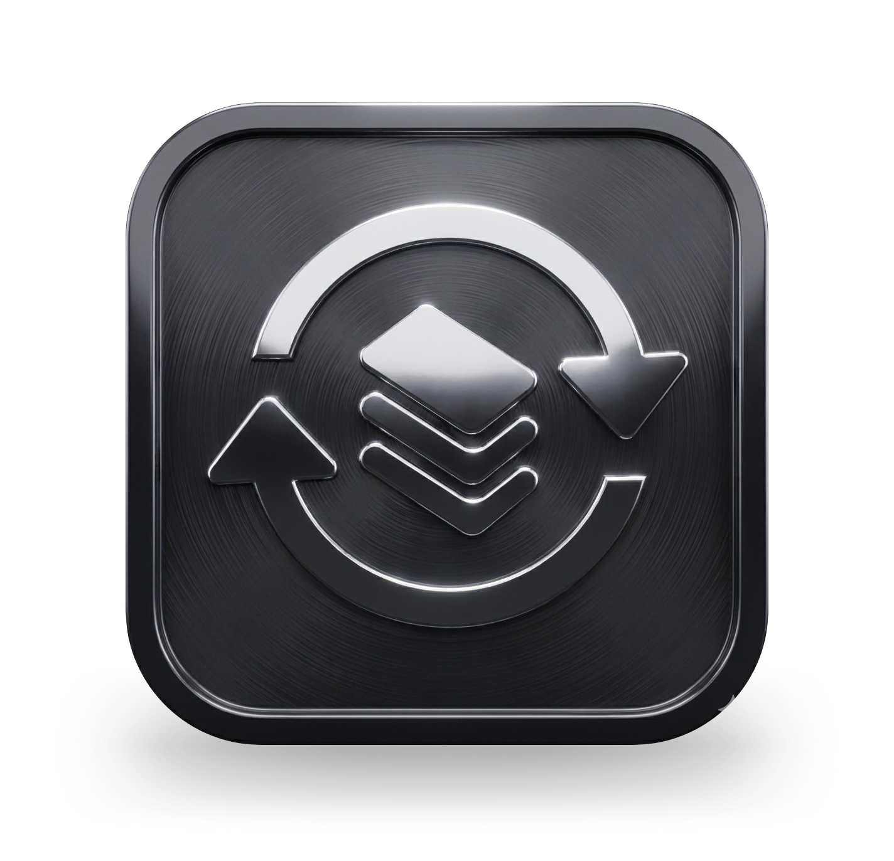
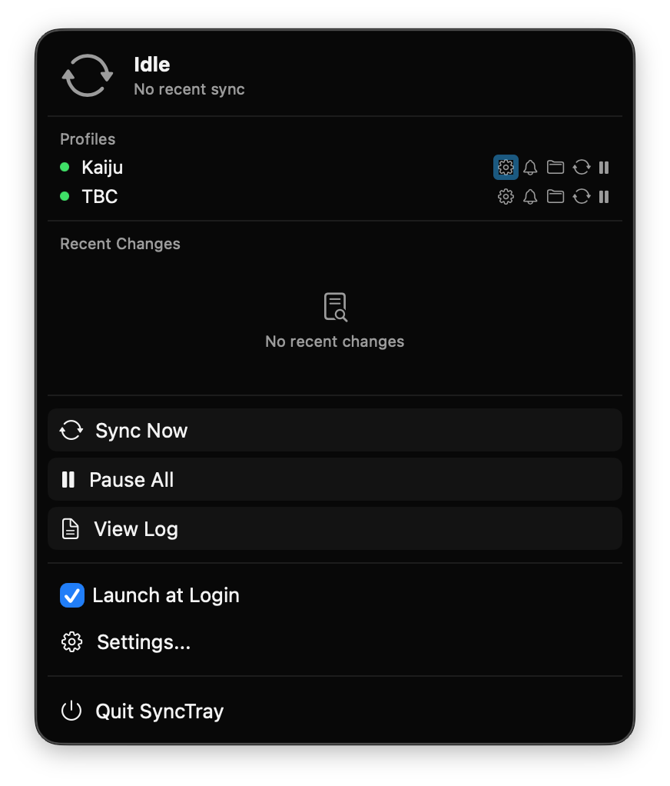
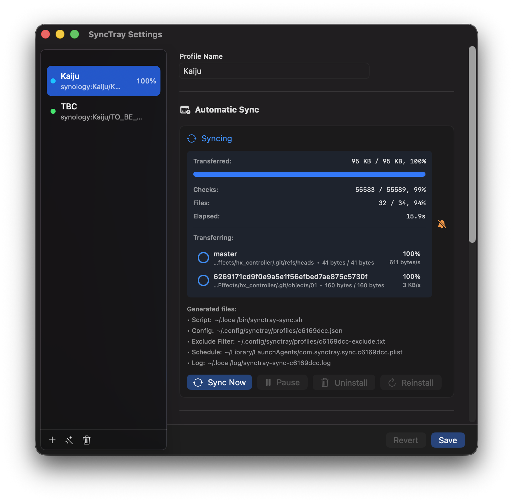
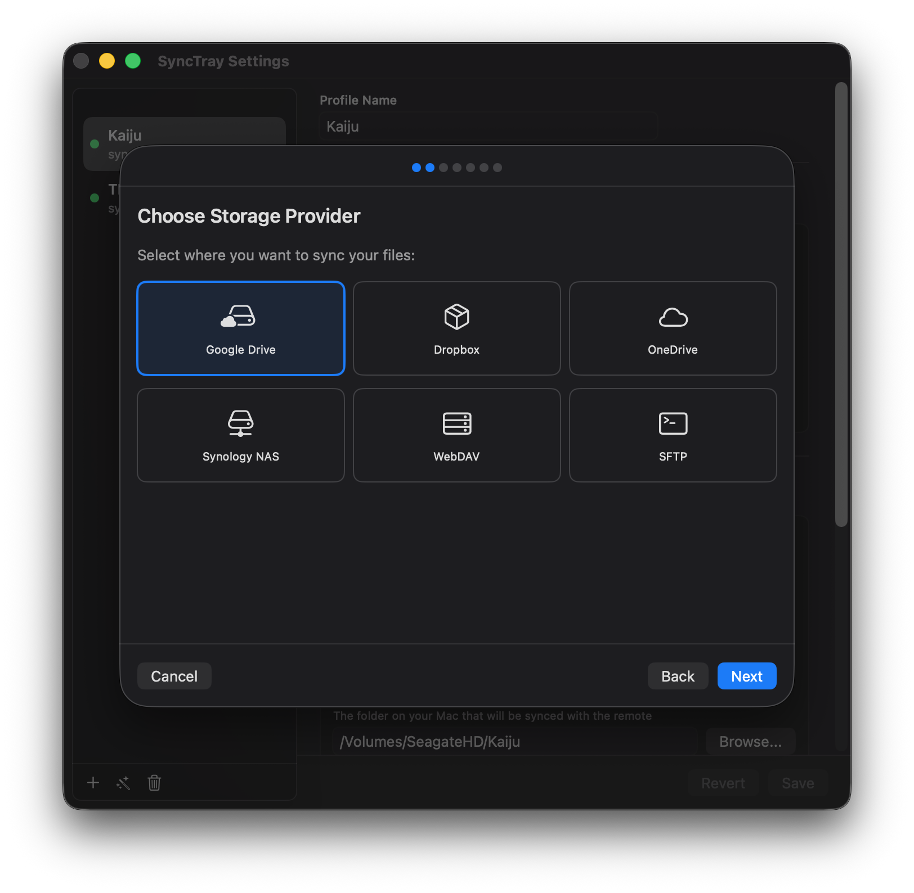

<p align="center">
  
</p>

<h1 align="center">SyncTray</h1>

<p align="center">
  <strong>Google Drive-style sync for any storage — your NAS, S3, SFTP, Google Drive, and 70+ more.</strong><br>
  A native macOS menu bar app for two-way sync, one-way backup, and on-demand streaming, built on <a href="https://rclone.org">rclone</a>.<br>
  Set it up in the app, or hand the whole setup to your AI agent.
</p>

<p align="center">
  <a href="https://github.com/mthines/sync-tray/releases/latest"></a>
  <a href="https://github.com/mthines/sync-tray/actions/workflows/ci.yml"></a>
  
  <a href="LICENSE"></a>
  <a href="https://discord.gg/KBp8kb3EwP"></a>
</p>

```bash
brew install rclone
brew install --cask mthines/synctray/synctray
```

<p align="center">
  
  &nbsp;&nbsp;
  
</p>

## Why SyncTray

rclone can talk to almost any storage, but on its own it's a terminal tool — no status, no schedule, no Finder integration.
SyncTray turns it into the Mac sync client you'd expect, pointed at storage you control.

- **Any storage.** Synology, SMB, SFTP, WebDAV, S3, Backblaze B2, Google Drive, OneDrive, Dropbox — anything rclone can reach.
- **Three modes, one app.** Two-way sync, one-way backup, or stream files on demand.
- **No kernel extension.** Streaming uses rclone's built-in NFS mount, so it works on managed Macs where macFUSE is blocked.
- **Works offline.** Right-click a folder in Finder → **Available Offline**. Lose the connection and keep editing — changes upload when you're back.
- **Runs without the app.** Syncs and mounts are launchd agents, so they keep going when the menu bar app is closed.
- **Careful with your files.** Two-way conflicts keep both copies, and a two-way sync that would delete more than half your files stops and asks first.
- **Agent-ready.** Plain JSON config with a published schema, and a `synctray` CLI with `--json` output and blocking `--wait`.

## Let your agent set it up

Claude Code, Codex, Cursor — any agent with a terminal can set up rclone and SyncTray for you 🤖
Install SyncTray, launch it once, and ask:

```text
Set up SyncTray to two-way sync ~/Projects with the Projects folder on my NAS.
Use rclone and the synctray CLI (in ~/.local/bin), and show me the profile before you turn it on.
```

If the NAS isn't connected in rclone yet, the agent does that too.
You step in only to sign in, type a password, or approve the profile.

→ [Agent setup guide](docs/agent-setup.md): what the agent does step by step, a more detailed prompt, and rules to give it.

## Three ways to sync

| Mode               | Best for                                   | What happens                                                   |
| ------------------ | ------------------------------------------ | -------------------------------------------------------------- |
| **Two-Way Sync**   | Files you work on from more than one place | Changes on either side reach the other, on a schedule you pick |
| **One-Way Sync**   | Backups and mirrors                        | One side is the source; the other always matches it            |
| **Stream (Mount)** | Big libraries that don't fit on disk       | Every file shows up in Finder and downloads when you open it   |

### Stream, with offline folders

A Stream profile mounts your remote as a folder.
Files download the first time you open them and stay cached for as long as you choose (7 days by default).

- **Available Offline.** Right-click any folder in Finder to keep it fully downloaded, with live progress in the menu bar.
- **Cache Only.** One click — or automatically, when the remote can't be reached as the mount starts — switches the mount to serve only what's cached. You can keep creating and editing files, and they upload when you resume. If the same file changed on the remote meanwhile, yours uploads as a separate conflict copy — nothing gets overwritten.
- **Resilient by default.** A stalled server returns an error within about 30 seconds instead of freezing Finder.

### Home and away

Give a profile a **fallback remote** — say, your NAS over SMB at home and over SFTP or QuickConnect everywhere else.
Each two-way and one-way sync checks the primary first and switches over in about 3 seconds when it can't reach it.
The menu bar shows which one is in use.

### Choose what syncs

- **Don't Sync** skips files by pattern, like `*.rpp-bak` or `**/BACKUP/**`. Nothing is deleted on either side.
- **Sync Only These Folders** does the opposite: pick a few folders from a remote folder browser and leave the rest alone.

### Always know what's going on

- A menu bar icon for idle, syncing, paused, error, drive disconnected, and setup needed.
- Live transfer progress — bytes, files, and speed — for syncs and for streamed files.
- Batched notifications, and the last 20 changed files one click away in Finder.
- **Sync Now**, **Pause**, and **Abort** per profile, plus an optional bandwidth limit.
- External drives are detected: syncs pause while the drive is unplugged and resume when it's back.

Full walkthroughs for every feature are in the [user guide](docs/user-guide.md).

## Install

You need **macOS 13 (Ventura) or later** and **[rclone](https://rclone.org/)**.
SyncTray ships as a universal app for Apple silicon and Intel, signed with a Developer ID and notarized by Apple.

**Homebrew (recommended)**

```bash
brew install rclone
brew install --cask mthines/synctray/synctray
```

**Download** the latest `.zip` from [Releases](https://github.com/mthines/sync-tray/releases/latest), unzip it, and drag `SyncTray.app` to `/Applications`.

**Build from source**

```bash
git clone https://github.com/mthines/sync-tray.git
cd sync-tray
xcodebuild -scheme SyncTray -configuration Release CODE_SIGNING_ALLOWED=NO build
```

An unsigned build runs, but the Finder extension only loads in a signed one — [DEVELOPMENT.md](DEVELOPMENT.md) covers local signing.

SyncTray finds rclone from Homebrew, `/usr/local/bin`, `/usr/bin`, and nix installs without extra configuration.

## Quick start

1. **Launch SyncTray.** The icon appears in the menu bar. A yellow gear means there's nothing set up yet.
2. **Open Settings → +** to start the setup wizard.
3. **Pick or connect a remote.** The wizard can connect Google Drive, Dropbox, OneDrive, Synology, SMB, WebDAV, and SFTP for you, or reuse any remote you already set up with `rclone config`.
4. **Choose the folders, the mode, and how often to sync** (every 1 minute to 1 hour; 5 minutes by default).
5. **Install.** SyncTray creates the local folder, runs the first sync (or mounts the remote), and schedules the rest.

<p align="center">
  
</p>

Prefer the terminal? Everything above is also `synctray profile create` — see [Let your agent set it up](#let-your-agent-set-it-up).

## Documentation

| Guide                                            | What's in it                                                                    |
| ------------------------------------------------ | ------------------------------------------------------------------------------- |
| [User guide](docs/user-guide.md)                 | Every sync mode and feature, step by step                                       |
| [Agent setup](docs/agent-setup.md)               | Setting SyncTray up from an AI agent or a script                                |
| [CLI reference](docs/cli.md)                     | Every `synctray` command, its output, and its exit codes                        |
| [Configuration files](docs/configuration.md)     | `~/.config/synctray/`, the profile schema, and every file SyncTray creates      |
| [Troubleshooting](docs/troubleshooting.md)       | Sync errors, mounts, slow streaming, and Gatekeeper                             |
| [Development](DEVELOPMENT.md)                    | Building, signing, telemetry, and releasing                                     |

## FAQ

**Is SyncTray free?**
Yes. It's open source under the MIT license.

**Do I need macFUSE?**
No. Stream mode uses rclone's NFS mount and needs nothing beyond rclone.
A macFUSE backend is still available per profile if you want it.

**Where are my passwords stored?**
In rclone's own config file, `~/.config/rclone/rclone.conf`.
SyncTray's profile files never contain credentials.

**Does it sync when the app is closed?**
Yes. Scheduled syncs and mounts run as launchd agents.
While the app is open, a local change also triggers a sync about 5 seconds after you stop editing.

**What does it send home?**
Nothing, unless you turn on **Share usage data** in App Settings.
If you do, it sends pseudonymous usage and error data — never file names, folder names, remote names, or credentials.
The full list is in the app under **Privacy & Telemetry**.

## Community and support

Questions, feedback, or a feature idea? Join the [SyncTray Discord](https://discord.gg/KBp8kb3EwP) — it's also linked from **Help & Feedback** in the menu bar.
Found a bug? [Open an issue](https://github.com/mthines/sync-tray/issues).

## Contributing

Pull requests are welcome 🙌
Start with [DEVELOPMENT.md](DEVELOPMENT.md) for building, testing, and the commit convention that drives releases.

## License

[MIT](LICENSE)

## Acknowledgments

- [rclone](https://rclone.org/) — the sync engine underneath everything
- [macFUSE](https://osxfuse.github.io/) — the optional FUSE mount backend
- [OpenTelemetry Swift](https://github.com/open-telemetry/opentelemetry-swift) — opt-in telemetry
