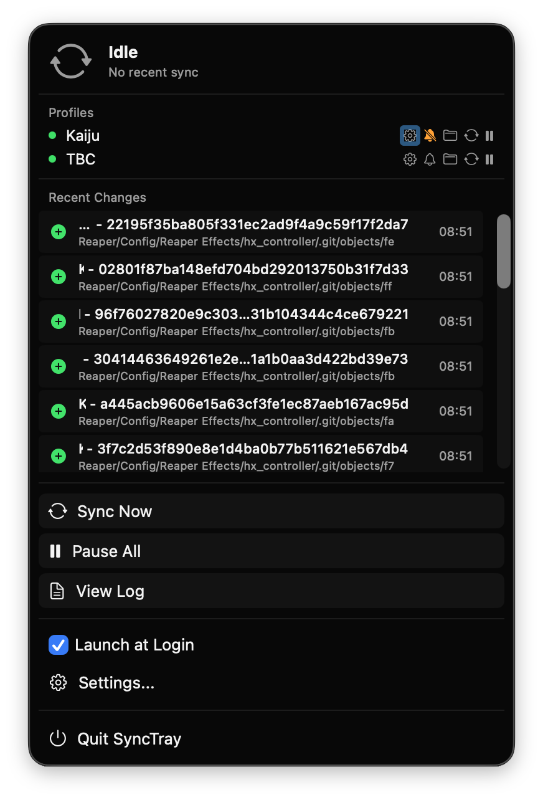

# User guide

How to use each sync mode and feature in SyncTray.
New here? Start with the [Quick start](../README.md#quick-start) in the README.

- [Create a profile](#create-a-profile)
- [Two-way sync](#two-way-sync)
- [One-way sync](#one-way-sync)
- [Stream (Mount)](#stream-mount)
- [Offline files](#offline-files)
- [Cache Only](#cache-only)
- [Fallback remote](#fallback-remote)
- [Choose what syncs](#choose-what-syncs)
- [Run, pause, and abort](#run-pause-and-abort)
- [Menu bar and notifications](#menu-bar-and-notifications)
- [Advanced options](#advanced-options)
- [App settings](#app-settings)

## Create a profile

A **profile** pairs one local folder with one folder on a remote, plus a mode and a schedule.
You can have as many as you like.

1. Click the menu bar icon → **Settings…**, then **+**.
2. Pick an existing rclone remote, or choose a provider to connect a new one.
   The wizard connects **Google Drive**, **Dropbox**, **OneDrive**, **Synology NAS**, **SMB / CIFS**, **WebDAV**, and **SFTP** directly.
   For anything else rclone supports — S3, Backblaze B2, iCloud Drive, and so on — run `rclone config` first, then pick the remote here.
3. Choose the remote folder, the local folder, the mode, and the sync interval.
4. Click **Install**.

Profiles are stored as files in `~/.config/synctray/profiles/`, so you can also create and edit them from a script or an AI agent — see [Agent setup](agent-setup.md).

## Two-way sync

For files you edit in more than one place.
SyncTray runs `rclone bisync` on your schedule, every 1 minute to 1 hour (5 minutes by default).
While the app is open, a local change also starts a sync about 5 seconds after you stop editing.

- **Conflicts keep both copies.** When a file changed on both sides, the newer version keeps the name and the other is renamed with a `sync-conflict-<date>` suffix.
- **Mass deletions stop.** If a run would delete more than half of the files, it stops instead. The profile shows **Delete from Remote** to go ahead, or **Restore from Remote** to bring the files back.
- **History is kept.** rclone's record of the last sync survives saving and reinstalling a profile, as long as its folders stay the same, so you don't get a full re-sync.
- **Auto-fix.** When two-way sync reports it's out of step, SyncTray runs a safe resync by itself, where the newer copy of a file wins. Turn this off in App Settings.

## One-way sync

For backups and mirrors.
Choose a direction:

- **Local → Remote** backs your Mac's folder up to the remote.
- **Remote → Local** mirrors the remote onto your Mac.

The destination always ends up matching the source, so files deleted from the source are deleted from the destination too.

## Stream (Mount)

For big libraries you don't want on disk.
The remote appears as a folder; files download the first time you open them and are served from a local cache after that.

1. Create a profile and choose **Stream (Mount)**.
2. Pick an empty local folder — it becomes the mount point.
3. Adjust the cache if you need to:
   - **Cache Size** — the maximum disk space the cache uses (10 GB by default).
   - **Keep Cached For** — how long a file stays cached after you last opened it (7 days by default).
   - **Cache Directory** — where cached files live (`~/.cache/rclone` by default). Put it on a fast APFS disk; see [slow streaming](troubleshooting.md#streaming-is-slow-for-files-that-are-already-cached).
4. Click **Install & Mount**.

The mount comes back at login unless you turn off **Mount automatically on startup**.
To unmount, use **Unmount** in the profile, or the eject button in the menu bar.

**No macFUSE needed.** Stream uses rclone's built-in NFS mount, so there's no kernel extension and no admin approval — it works on managed Macs too.

### Optional: macFUSE backend

If you prefer a classic FUSE mount, set **Mount Backend** to **macFUSE** in the profile.
That backend needs macFUSE and the official rclone binary, because Homebrew's rclone can't mount:

```bash
# 1. Install macFUSE, restart, and approve it in System Settings → Privacy & Security.
brew install --cask macfuse

# 2. Replace Homebrew's rclone with the official binary.
brew uninstall rclone
curl -O https://downloads.rclone.org/rclone-current-osx-arm64.zip
unzip rclone-current-osx-arm64.zip
cd rclone-*-osx-arm64
sudo cp rclone /usr/local/bin/
sudo chmod +x /usr/local/bin/rclone
rclone version
```

## Offline files

Keep chosen folders of a Stream profile fully downloaded, so they open instantly and work with no connection.

- **From Finder:** right-click a folder inside the mount → **SyncTray** → **Available Offline**. Run the same command again to make it online-only.
- **From the app:** add folders in the profile's **Offline Files** section.

Making a folder available offline downloads it in the background, with progress in the menu bar.
Files that are already cached are skipped.
If you start working with files in the mount, caching pauses automatically so your app gets the bandwidth, and you can pause it by hand from the menu bar.

- **Don't Download** patterns skip files you never want offline, such as `*.wav` or `**/Renders/**`.
- **Free Up Space** clears the cache but keeps your offline folders; **Clear Everything** removes those too.
- **Move Cache…** moves the cache, cached files included, to another disk.

The Finder menu needs a one-time approval under **System Settings → General → Login Items & Extensions → Extensions**.
The Offline Files section links you there.

## Cache Only

Cache Only switches a Stream profile to serve only what's already cached, with no network at all — while keeping the same folder, so file paths in your projects keep working.

- **Turn it on** with **Cache Only** in the profile. SyncTray also enters Cache Only by itself when the remote can't be reached as the mount starts.
- **Keep working.** You can open cached files, edit them, and create new ones. Changes are kept locally and counted as pending uploads.
- **Upload Now** sends pending changes without leaving Cache Only.
- **Resume Syncing** uploads everything and goes back to streaming. If SyncTray entered Cache Only by itself, it resumes on its own once the remote has been reachable for about 6 minutes and nothing has a file open in the mount.
- **Nothing gets overwritten.** If a file changed on the remote while you were offline, your version uploads as a conflict copy named `name.sync-conflict-YYYYMMDD-HHMMSS.ext`.

Limits:

- Files that are only partly cached are hidden while in Cache Only.
- You can't delete or rename a file that was cached before you entered Cache Only.
- Switching modes remounts the folder, which takes a moment.

## Fallback remote

For a remote you reach differently at home and away — for example a Synology over SMB on your network and over SFTP or QuickConnect everywhere else.

1. Create the second remote in rclone (or in the wizard).
2. In the profile, turn on **Enable Fallback Remote** and pick it.
3. If its folder path is different, turn on **Fallback uses a different path** and enter it. SyncTray checks that the path exists.

Each two-way and one-way sync tries the primary first and switches to the fallback when the primary doesn't answer within about 3 seconds.
The menu bar shows which one ran: a Wi-Fi icon for the primary, an antenna for the fallback.

| Setting | Primary (LAN)              | Fallback (anywhere)                        |
| ------- | -------------------------- | ------------------------------------------ |
| Remote  | `synology-webdav` (LAN IP) | `synology-quickconnect` (QuickConnect URL) |
| Path    | `MyShare/Documents`        | `MyShare/Documents` (same)                 |

| Setting | Primary (SMB)  | Fallback (SFTP over Tailscale) |
| ------- | -------------- | ------------------------------ |
| Remote  | `synology`     | `synology-sftp`                |
| Path    | `Kaiju/KAIJU`  | `/volume1/Kaiju/KAIJU`         |

Stream profiles don't stream through the fallback.
When their primary is unreachable they switch to [Cache Only](#cache-only) instead, and **Upload Now** can still send changes through the fallback.

## Choose what syncs

Both options apply to two-way and one-way profiles.

### Don't Sync

Skip files by pattern — for example `*.rpp-bak` for every Reaper backup, or `**/BACKUP/**` for every folder named `BACKUP` at any depth.

- Matching files stop syncing. Nothing is deleted on either side.
- Patterns are case-sensitive: `*` matches within one folder name, `?` one character, and `**` any number of folders.
- Changes apply from the next sync, with no re-sync.
- On a two-way profile, add broad patterns in steps. Excluding more than half of the files at once trips the [mass-deletion stop](#two-way-sync).

### Sync Only These Folders

Sync only the folders you list and leave everything else alone.

- Pick folders with **Choose Folders…**, or type paths relative to the profile's root, such as `Projects/Active`.
- An empty list syncs everything, which is the default.
- **Don't Sync** patterns still apply inside the chosen folders.
- On a two-way profile, changing the list schedules one safe resync on the next run, where the newer copy of a file wins. One-way profiles apply it on the next sync.

## Run, pause, and abort

- **Sync Now** runs every enabled profile immediately, from the menu bar or per profile.
- **Pause** stops a profile's schedule until you resume it. **Pause All** pauses every profile.
- **Abort** replaces Pause while a two-way or one-way profile is syncing. It stops the run so you can change settings and start again with **Sync Now**. A two-way sync first finishes the files in flight and saves its history, which can take up to about a minute and a half. The button then becomes **Force Stop** if you'd rather not wait. Files already transferred stay, and the schedule keeps running.

## Menu bar and notifications

| Icon                        | State             | Meaning                               |
| --------------------------- | ----------------- | ------------------------------------- |
| Gray sync arrows            | Idle              | Everything is up to date              |
| Blue sync arrows            | Syncing           | A sync is running                     |
| Gray pause circle           | Paused            | The profile is paused                 |
| Red warning triangle        | Error             | The last sync failed — open the log   |
| Orange drive with an X      | Drive not mounted | The profile's external drive is unplugged |
| Yellow gear                 | Setup required    | No profiles yet                       |

<p align="center">
  
</p>

- **Live progress:** bytes, file counts, and the files in flight, for syncs and for streamed files.
- **Recent changes:** the last 20 transferred files, each marked copied, updated, deleted, or renamed. Click one to show it in Finder.
- **Notifications** are batched: up to 3 files are listed by name, more are summarized. Click to open the folder. Mute a profile from its bell icon.
- **View Log** opens the profile's sync log.

## Advanced options

These live under **Advanced Options** in each profile.

| Option                     | Modes          | What it does                                                                  |
| -------------------------- | -------------- | ----------------------------------------------------------------------------- |
| **Bandwidth Limit**        | all            | Caps rclone's speed: `10M` (10 MB/s), `1M:512k` (up:down), or empty for no limit. Use it when SyncTray saturates your connection. |
| **Additional rclone Flags** | all           | Extra flags for every rclone command, for example `--exclude "*.tmp"`.        |
| **Download Connections**   | Stream         | Files downloaded in parallel, 1–16 (2 by default). On Wi-Fi or a mesh network, 1–2 is usually faster than more. |
| **Resilient Mount**        | Stream         | On by default. A stalled server returns an error in about 30 seconds instead of freezing Finder. |

**External drive.** When a profile's local folder is on an external drive, turn on **Skip sync when drive is disconnected** in the profile.
Syncs pause while the drive is unplugged and resume when it's back.

## App settings

Open **Settings…** and click the gear in the sidebar.

- **Launch at Login.**
- **Automatically recover from sync conflicts** — the two-way auto-fix described above.
- **Share usage data** — off until you turn it on. Sends pseudonymous usage and error data, never file names, folder names, remote names, or credentials. **Learn more** shows exactly what's collected.
- **Debug Logging** — verbose lines in the sync logs, for troubleshooting.
- **Join the SyncTray community on Discord** — also in the menu bar under **Help & Feedback**.
